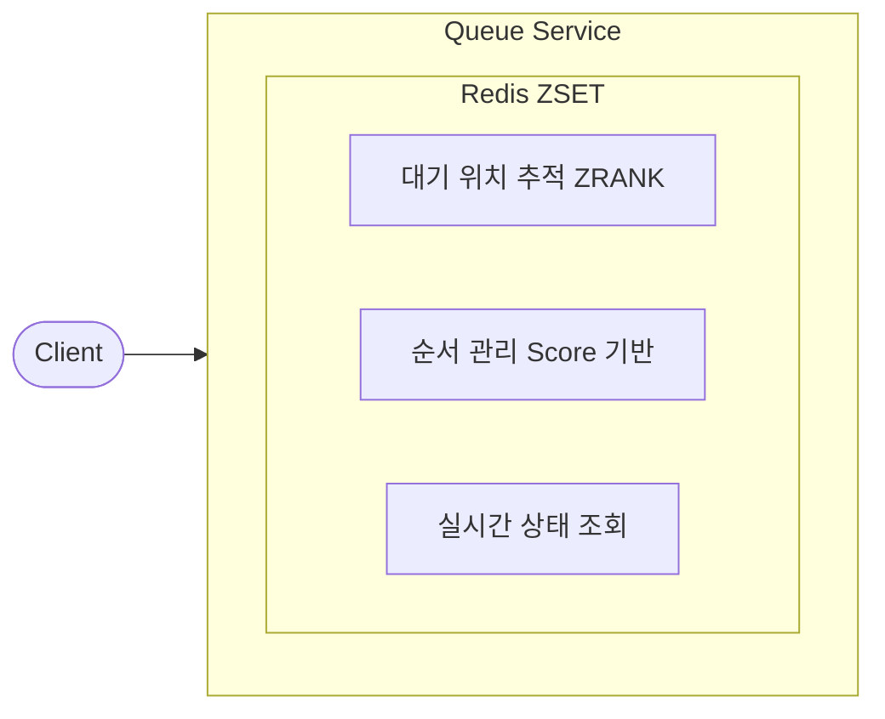
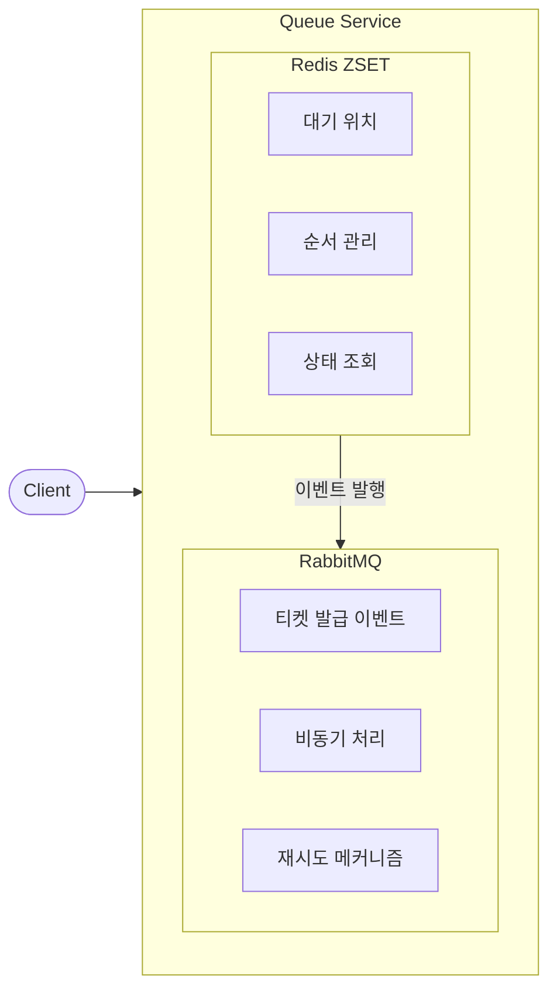
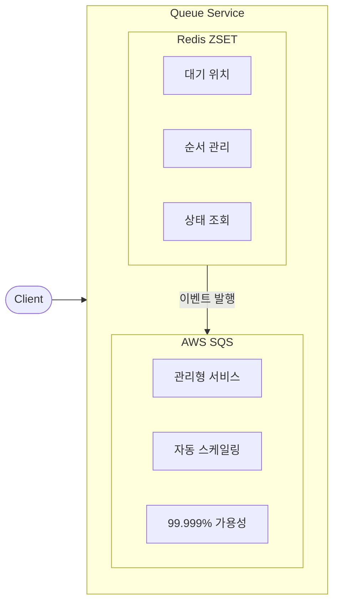
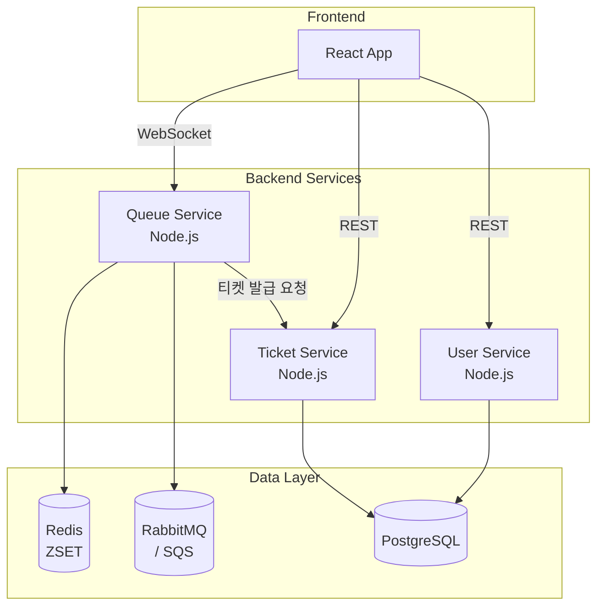

# Ticketing Queue System

다양한 메시지 큐 아키텍처를 학습하고 비교할 수 있는 교육용 티케팅 대기열 시스템입니다.

## 🎯 프로젝트 목적

이 프로젝트는 실제 티케팅 시스템을 구현하면서 다양한 큐 아키텍처의 특성, 장단점, 사용 사례를 직접 체험하고 학습할 수 있도록 설계되었습니다.

## 📊 지원하는 큐 아키텍처

### 1. Redis ZSET (기본)



| 장점 | 단점 |
|------|------|
| ✅ 빠른 위치 조회 (O(log N)) | ❌ 단일 노드 한계 |
| ✅ 실시간 순위 계산 | ❌ 메시지 영속성 제한 |
| ✅ 간단한 구현 | ❌ 복잡한 라우팅 불가 |

**사용 사례**: 실시간 대기열 위치 표시, 리더보드, 간단한 작업 큐

---

### 2. Redis + RabbitMQ (하이브리드)



| 장점 | 단점 |
|------|------|
| ✅ 실시간 위치 + 신뢰성 | ❌ 두 시스템 동기화 필요 |
| ✅ 메시지 영속성 보장 | ❌ 운영 복잡도 증가 |
| ✅ Dead Letter Queue 지원 | ❌ 인프라 비용 증가 |
| ✅ 워커 간 부하 분산 | |

**사용 사례**: 대규모 티케팅, 주문 처리, 이벤트 드리븐 아키텍처

---

### 3. Redis + AWS SQS (클라우드 네이티브)



| 장점 | 단점 |
|------|------|
| ✅ 완전 관리형 | ❌ AWS 종속성 |
| ✅ 무제한 확장성 | ❌ 지연 시간 (네트워크) |
| ✅ 인프라 관리 불필요 | ❌ 비용 예측 어려움 |
| ✅ FIFO 큐 지원 | |

**사용 사례**: AWS 기반 서비스, 서버리스 아키텍처, 대규모 분산 시스템

---

## 🔄 큐 모드 비교

### Simple Mode
- 단일 로비 대기열
- 직접 티켓 발급
- 기본 큐 개념 학습에 적합

### Advanced Mode
- 2단계 대기열 (로비 → 이벤트별 큐)
- 다중 이벤트 동시 처리
- 복잡한 큐 관리 패턴 학습

## 🏗️ 시스템 아키텍처



## 🚀 빠른 시작

```bash
# 1. 환경 설정 (.env 파일에서 QUEUE_PROVIDER 선택)
QUEUE_PROVIDER=rabbitmq  # redis, rabbitmq, sqs 중 선택

# 2. Docker Compose로 실행
docker-compose up -d

# 3. 접속
# - 프론트엔드: http://localhost
# - Redis Commander: http://localhost:8081
# - RabbitMQ Management: http://localhost:15672
```

## 📚 학습 가이드

상세한 학습 자료는 [guide/](guide/) 폴더를 참조하세요.

## 📁 프로젝트 구조

```
ticketing-queue-system/
├── backend/
│   ├── services/
│   │   ├── queue-service/     # 대기열 관리 서비스
│   │   ├── ticket-service/    # 티켓 발급 서비스
│   │   └── user-service/      # 사용자 관리 서비스
│   └── database/              # DB 스키마 및 연결
├── frontend/                  # React 프론트엔드
├── docs/                      # API 문서
├── guide/                     # 학습 가이드
└── docker-compose.yml         # Docker 설정
```

## 🛠️ 기술 스택

| 영역 | 기술 |
|------|------|
| Backend | Node.js 22, Express, TypeScript |
| Frontend | React 18, TypeScript, Vite |
| Real-time | Socket.io |
| Database | PostgreSQL 17, Redis 7 |
| Message Queue | RabbitMQ, AWS SQS |
| Container | Docker, Docker Compose |

## 📖 문서

- [아키텍처 개요](docs/architecture.md)
- [API 문서](docs/api/)
- [Docker 빠른 시작](DOCKER_QUICK_START.md)
- [AWS 배포 가이드](docs/deployment/aws-guide.md)

## 📝 라이선스

이 프로젝트는 교육 목적으로 제작되었습니다.
