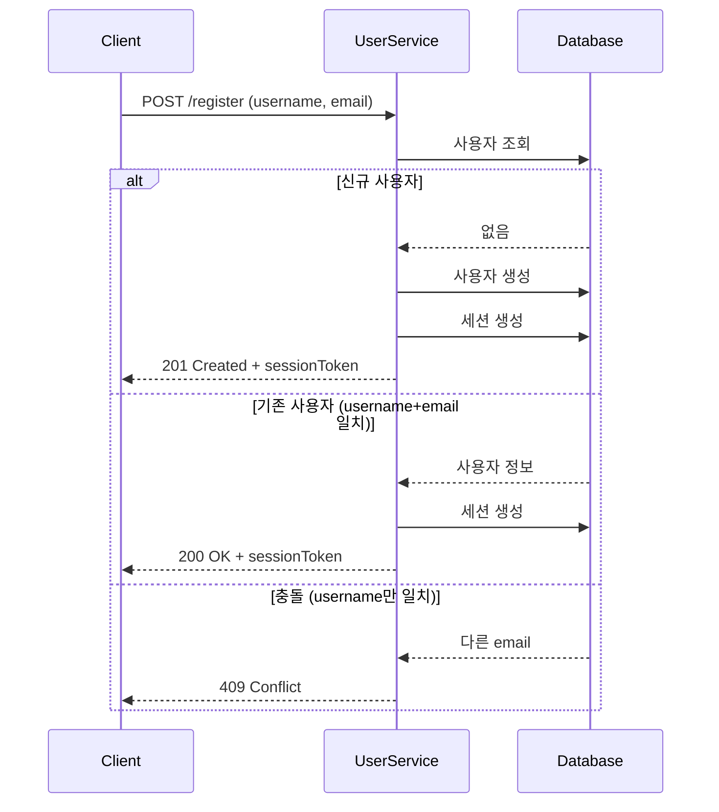

# User Service API

사용자 등록 및 인증 서비스 API 문서입니다.

## Base URL

```
http://localhost:3003/api/users
```

---

## 사용자 등록/로그인

새 사용자를 등록하거나 기존 사용자로 로그인합니다.

**Endpoint:** `POST /api/users/register`

**Request Body:**
```json
{
  "username": "john_doe",
  "email": "john@example.com"
}
```

**Response (201 Created) - 신규 사용자:**
```json
{
  "userId": "550e8400-e29b-41d4-a716-446655440000",
  "username": "john_doe",
  "email": "john@example.com",
  "sessionToken": "abc123...",
  "expiresAt": "2026-02-05T08:49:16.709Z"
}
```

**Response (200 OK) - 기존 사용자 로그인:**

username과 email이 모두 일치하는 경우 로그인 처리됩니다.

```json
{
  "userId": "550e8400-e29b-41d4-a716-446655440000",
  "username": "john_doe",
  "email": "john@example.com",
  "sessionToken": "abc123...",
  "expiresAt": "2026-02-05T08:49:16.709Z",
  "message": "Welcome back! Logged in successfully."
}
```

**Error Responses:**
| Status | Error | Description |
|--------|-------|-------------|
| 400 | ValidationError | username 또는 email 누락, 잘못된 형식 |
| 409 | ConflictError | username은 같지만 email이 다른 경우 (또는 반대) |

---

## 세션 인증

세션 토큰을 검증하고 사용자 정보를 반환합니다.

**Endpoint:** `GET /api/users/auth`

**Headers:**
```
Authorization: Bearer {sessionToken}
```

**Response (200 OK):**
```json
{
  "userId": "550e8400-e29b-41d4-a716-446655440000",
  "username": "john_doe",
  "email": "john@example.com"
}
```

**Error Responses:**
| Status | Error | Description |
|--------|-------|-------------|
| 401 | Unauthorized | 토큰 누락, 만료, 또는 유효하지 않음 |

---

## 사용자 정보 조회

사용자 ID로 사용자 정보를 조회합니다.

**Endpoint:** `GET /api/users/:userId`

**Response (200 OK):**
```json
{
  "userId": "550e8400-e29b-41d4-a716-446655440000",
  "username": "john_doe",
  "email": "john@example.com",
  "createdAt": "2026-02-04T08:49:16.709Z",
  "updatedAt": "2026-02-04T08:49:16.709Z"
}
```

**Error Responses:**
| Status | Error | Description |
|--------|-------|-------------|
| 404 | NotFoundError | 존재하지 않는 사용자 |

---

## Health Check

**Endpoint:** `GET /health`

**Response (200 OK):**
```json
{
  "status": "healthy",
  "timestamp": "2026-02-04T08:49:16.709Z",
  "service": "user-service",
  "dependencies": {
    "database": "connected"
  }
}
```

**Response (503 Service Unavailable):**
```json
{
  "status": "unhealthy",
  "timestamp": "2026-02-04T08:49:16.709Z",
  "service": "user-service",
  "dependencies": {
    "database": "disconnected"
  }
}
```

---

## 데이터 모델

### User

```typescript
interface User {
  userId: string;       // UUID
  username: string;     // 1-100자, 고유값
  email: string;        // 이메일 형식, 고유값
  createdAt: string;    // ISO 8601 타임스탬프
  updatedAt: string;    // ISO 8601 타임스탬프
}
```

### Session

```typescript
interface Session {
  sessionId: string;    // UUID
  userId: string;       // User 참조
  token: string;        // 세션 토큰 (고유값)
  expiresAt: string;    // 만료 시간 (기본 24시간)
  createdAt: string;    // ISO 8601 타임스탬프
}
```

---

## 인증 흐름



---

## 사용 예시

### 사용자 등록 및 인증 플로우

```bash
# 1. 사용자 등록
curl -X POST http://localhost:3003/api/users/register \
  -H "Content-Type: application/json" \
  -d '{"username": "alice", "email": "alice@example.com"}'

# 응답에서 sessionToken 추출
# {"userId":"...","sessionToken":"abc123...","expiresAt":"..."}

# 2. 세션 인증
curl -X GET http://localhost:3003/api/users/auth \
  -H "Authorization: Bearer abc123..."

# 3. 사용자 정보 조회
curl -X GET http://localhost:3003/api/users/550e8400-e29b-41d4-a716-446655440000
```

### 재로그인 (동일 username + email)

```bash
# 같은 정보로 다시 등록 시도 → 로그인 처리
curl -X POST http://localhost:3003/api/users/register \
  -H "Content-Type: application/json" \
  -d '{"username": "alice", "email": "alice@example.com"}'

# 응답: 200 OK + "Welcome back! Logged in successfully."
```
