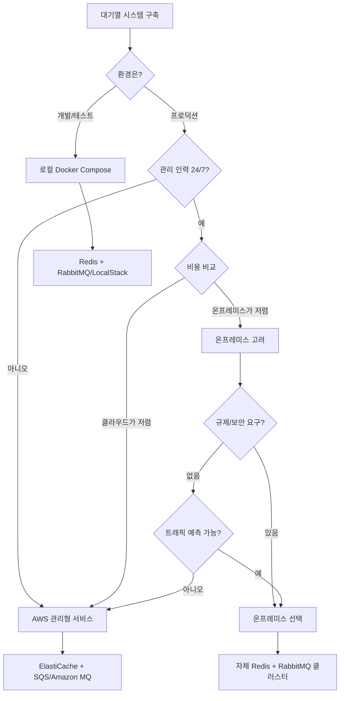

# 00. 큐 아키텍처 선택 원칙

[목차](./README.md) | [01. Redis ZSET →](./01-redis-zset.md)

---

## 개요

대기열 시스템의 아키텍처를 선택할 때 고려해야 할 핵심 원칙들을 정리합니다.

---

## 핵심 선택 기준

### 1. 고가용성 (High Availability)

클라우드 네이티브 환경에서는 **고가용성이 보장되는 솔루션**을 우선 선택해야 합니다.

| 요구사항 | 설명 |
|----------|------|
| 자동 장애 복구 | 노드 장애 시 자동 페일오버 |
| 다중 AZ 배포 | 가용 영역 장애에도 서비스 지속 |
| 데이터 복제 | 실시간 데이터 동기화 |
| 무중단 업데이트 | 서비스 중단 없는 패치/업그레이드 |

### 2. 비용 효율성

| 고려 사항 | 설명 |
|-----------|------|
| 초기 비용 | 인프라 구축 비용 |
| 운영 비용 | 월간 사용료, 데이터 전송 비용 |
| 인력 비용 | 관리/운영 인력 필요 여부 |
| 확장 비용 | 트래픽 증가 시 비용 변화 |

### 3. 운영 편의성

| 요구사항 | 설명 |
|----------|------|
| 관리 부담 최소화 | 패치, 백업, 모니터링 자동화 |
| 간편한 스케일링 | 클릭 몇 번으로 용량 조정 |
| 통합 모니터링 | CloudWatch 등 기존 도구와 연동 |
| 문서화/지원 | 공식 문서, 기술 지원 가용성 |

### 4. 모니터링 용이성

| 요구사항 | 설명 |
|----------|------|
| 메트릭 수집 | CPU, 메모리, 큐 깊이 등 |
| 알람 설정 | 임계치 초과 시 알림 |
| 로그 통합 | 중앙 집중식 로그 관리 |
| 대시보드 | 실시간 상태 시각화 |

### 5. 데이터 복원성 (Durability)

서비스 장애나 재시작 시에도 **데이터가 유실되지 않고 복원 가능**해야 합니다.

| 요구사항 | 설명 |
|----------|------|
| 영속성 보장 | 메모리 데이터의 디스크 저장 |
| 자동 백업 | 정기적인 스냅샷 생성 |
| 빠른 복구 | 장애 후 신속한 데이터 복원 |
| 재연결 용이 | 서비스 재시작 후 기존 상태 유지 |

**Redis 영속성 옵션:**

| 방식 | 설명 | 복구 시간 |
|------|------|-----------|
| RDB (Snapshot) | 주기적 스냅샷 저장 | 빠름 (마지막 스냅샷 이후 데이터 유실 가능) |
| AOF (Append Only File) | 모든 쓰기 명령 로깅 | 느림 (데이터 유실 최소화) |
| RDB + AOF | 두 방식 병행 | 균형 잡힌 복구 |

**관리형 서비스의 장점:**

| 서비스 | 복원성 기능 |
|--------|-------------|
| ElastiCache | 자동 백업, 다중 AZ 복제, 스냅샷 복원 |
| Amazon MQ | 메시지 영속성, 자동 페일오버 |
| Amazon SQS | 메시지 자동 보존 (최대 14일), 무손실 보장 |

> 💡 **핵심**: 백엔드나 큐 서비스에 문제가 생겨도, 데이터 저장소가 살아있으면 언제든 다시 붙어서 작업을 이어갈 수 있습니다. 이것이 **상태(State)와 처리(Processing)의 분리** 원칙입니다.

---

## 환경별 권장 구성

### 개발 환경 (Local Development)

비용 절감과 다양한 테스트를 위해 **로컬에서 모든 컴포넌트를 실행**합니다.

```
┌─────────────────────────────────────────────────────┐
│                  개발자 로컬 환경                    │
├─────────────────────────────────────────────────────┤
│  Docker Compose                                     │
│  ├── Redis (localhost:6379)                        │
│  ├── PostgreSQL (localhost:5432)                   │
│  ├── RabbitMQ (localhost:5672)                     │
│  └── LocalStack SQS (localhost:4566)               │
└─────────────────────────────────────────────────────┘
```

**장점:**
- 비용 없음 (로컬 리소스만 사용)
- 빠른 개발 사이클
- 오프라인 개발 가능
- 다양한 시나리오 테스트 용이

### 프로덕션 환경 (Cloud Deployment)

클라우드 배포 시에는 **관리형 서비스(Managed Service)로 전환**합니다.

```
┌─────────────────────────────────────────────────────┐
│                  AWS 프로덕션 환경                   │
├─────────────────────────────────────────────────────┤
│  관리형 서비스                                       │
│  ├── Amazon ElastiCache (Redis)                    │
│  ├── Amazon RDS for PostgreSQL                     │
│  └── Amazon SQS 또는 Amazon MQ                     │
└─────────────────────────────────────────────────────┘
```

| 로컬 컴포넌트 | AWS 관리형 서비스 | 전환 이유 |
|---------------|-------------------|-----------|
| Redis | Amazon ElastiCache | 자동 페일오버, 다중 AZ, 백업 |
| PostgreSQL | Amazon RDS | 자동 백업, 읽기 복제본, 패치 자동화 |
| RabbitMQ | Amazon MQ | 관리형 브로커, 고가용성 |
| SQS (LocalStack) | Amazon SQS | 완전 관리형, 무제한 확장 |

---

## 온프레미스 vs 클라우드

### 온프레미스를 고려할 수 있는 경우

| 조건 | 설명 |
|------|------|
| 비용이 과도한 경우 | 대규모 트래픽으로 클라우드 비용이 감당 불가 |
| 24/7 관리 인력 확보 | 전담 인프라 팀이 상시 운영 가능 |
| 규제/보안 요구사항 | 데이터가 특정 물리적 위치에 있어야 함 |
| 예측 가능한 워크로드 | 트래픽 변동이 거의 없음 |

### 온프레미스의 어려움

| 과제 | 설명 |
|------|------|
| 장애 대응 | 새벽/주말 장애 시 즉각 대응 필요 |
| 용량 계획 | 트래픽 급증 대비 여유 용량 확보 |
| 업그레이드 | 다운타임 없는 업그레이드 어려움 |
| 전문성 | Redis, RabbitMQ 등 각 기술별 전문가 필요 |
| 모니터링 | 별도 모니터링 시스템 구축/운영 |

> ⚠️ **권장**: 특별한 이유가 없다면 **관리형 서비스**를 사용하세요.  
> 인프라 관리보다 비즈니스 로직에 집중하는 것이 더 가치 있습니다.

---

## 아키텍처 선택 플로우차트



---

## 이 가이드의 구성

| 문서 | 내용 | 권장 환경 |
|------|------|-----------|
| [01. Redis ZSET](./01-redis-zset.md) | Redis만으로 대기열 구현 | 소규모, 단순 요구사항 |
| [02. Redis + RabbitMQ](./02-redis-rabbitmq.md) | 하이브리드 아키텍처 | 온프레미스, Amazon MQ |
| [03. Redis + SQS](./03-redis-sqs.md) | AWS 네이티브 구성 | AWS 프로덕션 |
| [04. Redis + Kafka](./04-redis-kafka.md) | 대용량 스트리밍 아키텍처 | AWS MSK, 대규모 이벤트 |
| [05. 비교](./05-comparison.md) | 아키텍처별 장단점 비교 | 의사결정 참고 |
| [06. EKS 자체 운영](./06-eks-self-managed.md) | Kubernetes에서 직접 운영 | 비용 최적화, 커스터마이징 |

---

## 핵심 요약

1. **고가용성 우선**: 클라우드 네이티브 = 장애에 강한 아키텍처
2. **비용 + 관리 편의성**: 저렴하고 관리가 쉬운 솔루션 선택
3. **모니터링 필수**: 문제를 빠르게 감지하고 대응할 수 있어야 함
4. **데이터 복원성**: 서비스 재시작 시 기존 상태로 빠르게 복구 가능해야 함
5. **개발 ≠ 프로덕션**: 로컬에서 테스트하고, 클라우드에선 관리형 서비스로
6. **온프레미스는 신중히**: 24/7 관리 인력과 비용 이점이 확실할 때만

---

[목차](./README.md) | [01. Redis ZSET →](./01-redis-zset.md)
