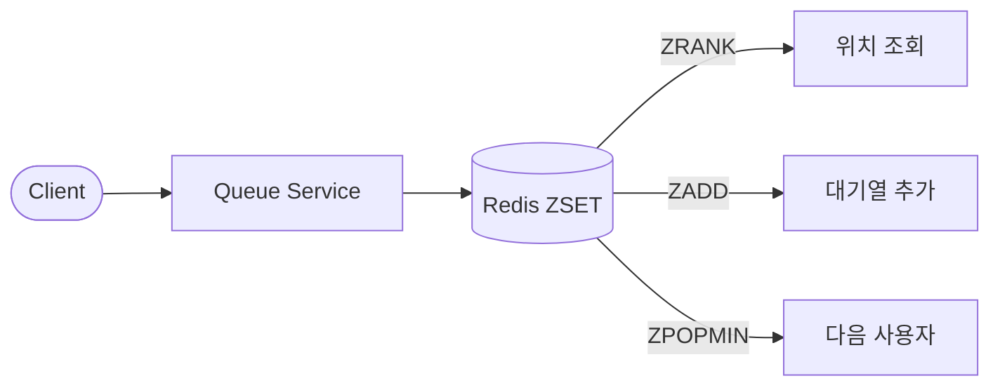

# Redis ZSET 기반 대기열

Redis의 Sorted Set(ZSET)을 활용한 가장 기본적인 대기열 구현 방식입니다.

## 개요



## 핵심 개념

### ZSET이란?
- **Sorted Set**: 각 멤버가 score를 가지는 정렬된 집합
- **자동 정렬**: score 기준으로 항상 정렬 상태 유지
- **중복 방지**: 같은 멤버는 자동으로 중복 제거

### 대기열에서의 활용
```typescript
// timestamp를 score로 사용하여 FIFO 보장
await redis.zAdd('queue:lobby', {
  score: Date.now(),      // 입장 시간
  value: 'user-123'       // 사용자 ID
});

// 현재 위치 조회 (0-based index)
const position = await redis.zRank('queue:lobby', 'user-123');

// 다음 사용자 꺼내기
const next = await redis.zPopMin('queue:lobby');
```

## 장점

| 장점 | 설명 |
|------|------|
| ⚡ **빠른 조회** | O(log N) 시간 복잡도로 위치 조회 |
| 🔄 **실시간 순위** | ZRANK로 즉시 현재 위치 확인 |
| 🛠️ **간단한 구현** | 별도 인프라 없이 Redis만으로 구현 |
| 🔒 **자동 중복 제거** | 같은 사용자 중복 진입 자동 방지 |
| 📊 **범위 조회** | ZRANGE로 특정 범위 사용자 조회 가능 |

## 단점

| 단점 | 설명 |
|------|------|
| 🖥️ **단일 노드 한계** | Redis Cluster 없이는 수평 확장 어려움 |
| 💾 **메모리 의존** | 모든 데이터가 메모리에 저장 |
| 🔄 **영속성 제한** | 장애 시 데이터 손실 가능성 |
| 📬 **메시지 기능 없음** | Pub/Sub 외 고급 메시징 기능 부재 |
| 🔀 **라우팅 불가** | 복잡한 메시지 라우팅 패턴 구현 어려움 |

## 사용 사례

### ✅ 적합한 경우
- 실시간 대기열 위치 표시가 필요한 경우
- 단순한 FIFO 대기열
- 리더보드, 랭킹 시스템
- 소규모~중규모 트래픽 (수만 TPS 이하)
- 빠른 프로토타이핑

### ❌ 부적합한 경우
- 메시지 영속성이 중요한 경우
- 복잡한 메시지 라우팅이 필요한 경우
- 여러 워커 간 작업 분산이 필요한 경우
- 재시도/Dead Letter Queue가 필요한 경우

## 주요 명령어

```bash
# 대기열 추가
ZADD queue:lobby <timestamp> <userId>

# 위치 조회 (0-based)
ZRANK queue:lobby <userId>

# 대기열 크기
ZCARD queue:lobby

# 다음 사용자 꺼내기
ZPOPMIN queue:lobby

# 상위 N명 조회
ZRANGE queue:lobby 0 9

# 특정 사용자 제거
ZREM queue:lobby <userId>
```

## 구현 예시

```typescript
class RedisQueueService {
  private redis: RedisClientType;

  async addToQueue(userId: string): Promise<number> {
    const score = Date.now();
    await this.redis.zAdd('queue:lobby', { score, value: userId });
    const position = await this.redis.zRank('queue:lobby', userId);
    return position ?? -1;
  }

  async getPosition(userId: string): Promise<number | null> {
    const rank = await this.redis.zRank('queue:lobby', userId);
    return rank !== null ? rank + 1 : null; // 1-based position
  }

  async processNext(): Promise<string | null> {
    const result = await this.redis.zPopMin('queue:lobby');
    return result?.value ?? null;
  }

  async getQueueSize(): Promise<number> {
    return await this.redis.zCard('queue:lobby');
  }
}
```

## 성능 특성

| 연산 | 시간 복잡도 | 설명 |
|------|-------------|------|
| ZADD | O(log N) | 대기열 추가 |
| ZRANK | O(log N) | 위치 조회 |
| ZCARD | O(1) | 크기 조회 |
| ZPOPMIN | O(log N) | 다음 사용자 |
| ZREM | O(log N) | 사용자 제거 |

## 다음 단계

Redis ZSET만으로는 메시지 영속성과 복잡한 처리가 어렵습니다.
→ [Redis + RabbitMQ 하이브리드](02-redis-rabbitmq.md)로 확장해보세요.


## ⚠️ 운영 레벨 위험 상황

### 1. 메모리 고갈 (OOM)

**상황**: 대기열이 예상보다 빠르게 증가하여 Redis 메모리 한계 도달

```bash
# Redis 로그
WARNING: Memory usage > maxmemory. OOM command not allowed.
```

**증상**:
- ZADD 명령 실패
- 새로운 사용자 대기열 진입 불가
- 기존 데이터 eviction (설정에 따라)

**원인**:
- 트래픽 급증 (티켓 오픈 시점)
- 처리 속도 < 유입 속도
- maxmemory 설정 미흡

**대응**:
```bash
# 현재 메모리 확인
redis-cli INFO memory | grep used_memory_human

# 긴급 메모리 확보 (위험!)
redis-cli FLUSHDB  # 절대 프로덕션에서 실행 금지

# 안전한 방법: 오래된 항목 정리
redis-cli ZREMRANGEBYRANK queue:lobby 0 -10001  # 상위 10000개만 유지
```

**예방**:
```bash
# maxmemory 설정 (redis.conf)
maxmemory 2gb
maxmemory-policy noeviction  # OOM 시 에러 반환 (데이터 보호)

# 모니터링 알람 설정
# used_memory > maxmemory * 0.8 → 경고
```

---

### 2. 단일 장애점 (SPOF)

**상황**: Redis 서버 다운 시 전체 대기열 시스템 마비

**증상**:
- 모든 API 요청 실패
- 대기열 위치 조회 불가
- 신규 진입 불가

**원인**:
- 서버 하드웨어 장애
- 네트워크 단절
- Redis 프로세스 크래시
- OOM Killer에 의한 강제 종료

**대응**:
```bash
# Redis 상태 확인
redis-cli PING

# 프로세스 확인
ps aux | grep redis

# 재시작
sudo systemctl restart redis
```

**예방**:
```yaml
# Redis Sentinel 구성 (고가용성)
sentinel monitor mymaster 127.0.0.1 6379 2
sentinel down-after-milliseconds mymaster 5000
sentinel failover-timeout mymaster 60000

# 또는 Redis Cluster 구성
```

---

### 3. 데이터 유실

**상황**: 서버 재시작 또는 장애 시 대기열 데이터 손실

**증상**:
- 재시작 후 대기열 비어있음
- 사용자 위치 정보 사라짐
- 고객 클레임 폭주

**원인**:
- RDB/AOF 미설정
- 비정상 종료로 마지막 스냅샷 이후 데이터 손실
- 디스크 공간 부족으로 저장 실패

**대응**:
```bash
# 마지막 저장 시점 확인
redis-cli LASTSAVE

# 수동 저장 (블로킹)
redis-cli BGSAVE
```

**예방**:
```bash
# redis.conf - AOF 활성화 (권장)
appendonly yes
appendfsync everysec  # 최대 1초 데이터 손실

# RDB 스냅샷 설정
save 900 1      # 15분마다 1개 이상 변경 시
save 300 10     # 5분마다 10개 이상 변경 시
save 60 10000   # 1분마다 10000개 이상 변경 시
```

---

### 4. 실수로 인한 데이터 삭제

**상황**: 운영자가 실수로 FLUSHDB 또는 DEL 명령 실행

```bash
# 치명적 실수 예시
redis-cli FLUSHDB           # DB 전체 삭제
redis-cli DEL queue:lobby   # 대기열 삭제
redis-cli KEYS * | xargs redis-cli DEL  # 모든 키 삭제
```

**증상**:
- 대기열 즉시 소멸
- 복구 불가능 (백업 없으면)
- 수천~수만 명 대기 정보 손실

**대응**:
```bash
# AOF 파일에서 복구 시도
redis-cli DEBUG LOADAOF

# RDB 백업에서 복구
cp /backup/dump.rdb /var/lib/redis/dump.rdb
sudo systemctl restart redis
```

**예방**:
```bash
# 위험 명령어 비활성화 (redis.conf)
rename-command FLUSHDB ""
rename-command FLUSHALL ""
rename-command DEBUG ""
rename-command KEYS "KEYS_DISABLED"

# 또는 비밀 명령어로 변경
rename-command FLUSHDB "FLUSHDB_a1b2c3d4"
```

---

### 5. 연결 고갈

**상황**: 클라이언트 연결 수가 maxclients 초과

```bash
# 에러 메시지
ERR max number of clients reached
```

**증상**:
- 새로운 연결 거부
- 일부 서비스 Redis 접근 불가
- 간헐적 타임아웃

**원인**:
- 연결 풀 미사용
- 연결 누수 (close 안 함)
- 트래픽 급증

**대응**:
```bash
# 현재 연결 수 확인
redis-cli CLIENT LIST | wc -l
redis-cli INFO clients

# 유휴 연결 강제 종료
redis-cli CLIENT KILL TYPE normal
```

**예방**:
```bash
# maxclients 증가 (redis.conf)
maxclients 10000

# 타임아웃 설정
timeout 300  # 5분 유휴 시 연결 종료

# 애플리케이션: 연결 풀 사용
const pool = createPool({ max: 50, min: 5 });
```

---

### 6. Slow Query로 인한 블로킹

**상황**: KEYS * 같은 O(N) 명령어로 전체 시스템 지연

```bash
# 위험한 명령어 예시
KEYS *              # O(N) - 절대 금지
SMEMBERS huge_set   # 큰 Set 전체 조회
ZRANGE queue 0 -1   # 전체 대기열 조회
```

**증상**:
- 모든 요청 지연 (Redis는 싱글 스레드)
- 타임아웃 발생
- 서비스 전체 느려짐

**대응**:
```bash
# 현재 실행 중인 명령 확인
redis-cli SLOWLOG GET 10

# 블로킹 명령 강제 종료
redis-cli CLIENT KILL ID <client-id>
```

**예방**:
```bash
# slowlog 설정
slowlog-log-slower-than 10000  # 10ms 이상 기록
slowlog-max-len 128

# KEYS 대신 SCAN 사용
redis-cli SCAN 0 MATCH "queue:*" COUNT 100

# 위험 명령어 비활성화
rename-command KEYS ""
```

---

### 7. 네트워크 파티션

**상황**: Redis와 애플리케이션 서버 간 네트워크 단절

**증상**:
- 연결 타임아웃
- 일부 서버만 Redis 접근 가능
- 데이터 불일치 (Split Brain)

**대응**:
```typescript
// 재연결 로직
const client = createClient({
  socket: {
    reconnectStrategy: (retries) => {
      if (retries > 10) return new Error('Max retries reached');
      return Math.min(retries * 100, 3000);
    }
  }
});
```

**예방**:
- Redis Sentinel/Cluster 구성
- 다중 AZ 배포
- 헬스체크 및 자동 페일오버

---

### 운영 체크리스트

| 항목 | 확인 |
|------|------|
| maxmemory 설정 | ☐ |
| AOF/RDB 백업 설정 | ☐ |
| 위험 명령어 비활성화 | ☐ |
| 모니터링 알람 설정 | ☐ |
| 연결 풀 사용 | ☐ |
| Sentinel/Cluster 구성 | ☐ |
| 정기 백업 스케줄 | ☐ |
| 복구 절차 문서화 | ☐ |
| 장애 대응 훈련 | ☐ |
