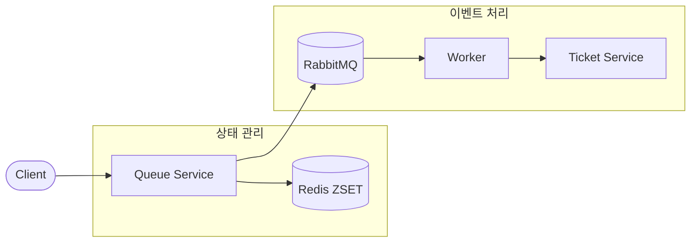
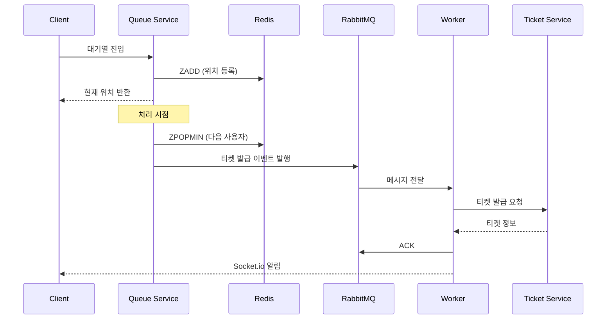
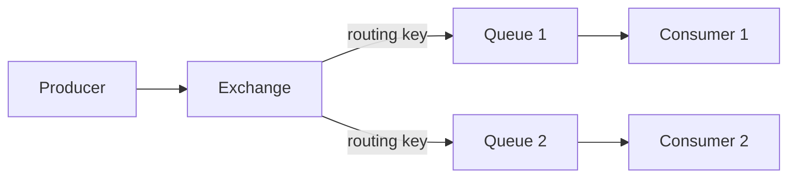

# Redis + RabbitMQ 하이브리드

Redis ZSET의 실시간 위치 추적과 RabbitMQ의 신뢰성 있는 메시지 처리를 결합한 아키텍처입니다.

## 개요



## 역할 분담

### Redis ZSET
| 역할 | 설명 |
|------|------|
| 📍 위치 추적 | 사용자의 실시간 대기 위치 |
| 🔢 순서 관리 | FIFO 순서 보장 |
| 🔍 상태 조회 | 빠른 위치/크기 조회 |
| 🚫 중복 방지 | 같은 사용자 중복 진입 차단 |

### RabbitMQ
| 역할 | 설명 |
|------|------|
| 📬 이벤트 발행 | 티켓 발급 요청 큐잉 |
| ⚖️ 부하 분산 | 여러 워커 간 작업 분배 |
| 🔄 재시도 | 실패 시 자동 재시도 |
| 💀 DLQ | Dead Letter Queue로 실패 메시지 관리 |

## 워크플로우



## 장점

| 장점 | 설명 |
|------|------|
| ⚡ **실시간 + 신뢰성** | Redis의 속도와 RabbitMQ의 안정성 결합 |
| 💾 **메시지 영속성** | 디스크 저장으로 장애 시에도 메시지 보존 |
| 💀 **DLQ 지원** | 실패 메시지 별도 관리 및 분석 가능 |
| ⚖️ **부하 분산** | 여러 워커가 동시에 메시지 처리 |
| 🔀 **유연한 라우팅** | Exchange를 통한 다양한 라우팅 패턴 |
| 🔄 **재시도 메커니즘** | 자동 재시도 및 지수 백오프 |

## 단점

| 단점 | 설명 |
|------|------|
| 🔄 **동기화 복잡성** | Redis와 RabbitMQ 상태 일관성 유지 필요 |
| 🏗️ **운영 복잡도** | 두 시스템 모니터링 및 관리 |
| 💰 **인프라 비용** | 추가 서버/리소스 필요 |
| 📚 **학습 곡선** | RabbitMQ 개념 학습 필요 |

## 사용 사례

### ✅ 적합한 경우
- 대규모 티케팅 시스템
- 주문 처리 시스템
- 이벤트 드리븐 아키텍처
- 메시지 손실이 허용되지 않는 경우
- 여러 서비스 간 비동기 통신

### ❌ 부적합한 경우
- 단순한 대기열만 필요한 경우
- 인프라 관리 리소스가 부족한 경우
- 클라우드 네이티브 환경 (SQS 권장)

## RabbitMQ 핵심 개념

### Exchange Types
```
Direct   : 정확한 routing key 매칭
Fanout   : 모든 바인딩된 큐에 브로드캐스트
Topic    : 패턴 매칭 (*.ticket.#)
Headers  : 헤더 기반 라우팅
```

### 메시지 흐름


## 구현 예시

### Producer (Queue Service)
```typescript
class HybridQueueService {
  private redis: RedisClientType;
  private channel: Channel;

  async processNextUser(): Promise<void> {
    // 1. Redis에서 다음 사용자 가져오기
    const next = await this.redis.zPopMin('queue:lobby');
    if (!next) return;

    // 2. RabbitMQ에 이벤트 발행
    const message = {
      userId: next.value,
      eventId: 'event-123',
      timestamp: Date.now()
    };

    this.channel.publish(
      'ticket-exchange',
      'ticket.issue',
      Buffer.from(JSON.stringify(message)),
      { persistent: true }  // 메시지 영속성
    );
  }
}
```

### Consumer (Worker)
```typescript
class TicketWorker {
  async start(): Promise<void> {
    await this.channel.consume('ticket-issue-queue', async (msg) => {
      if (!msg) return;

      try {
        const data = JSON.parse(msg.content.toString());
        
        // 티켓 발급
        const ticket = await this.ticketService.issue(data.userId);
        
        // Socket.io 알림
        this.io.to(data.userId).emit('ticket:issued', ticket);
        
        // 성공 ACK
        this.channel.ack(msg);
      } catch (error) {
        // 실패 시 재시도 또는 DLQ
        this.channel.nack(msg, false, false);
      }
    });
  }
}
```

## Dead Letter Queue 설정

```typescript
// 메인 큐 설정
await channel.assertQueue('ticket-issue-queue', {
  durable: true,
  arguments: {
    'x-dead-letter-exchange': 'dlx-exchange',
    'x-dead-letter-routing-key': 'ticket.failed',
    'x-message-ttl': 60000  // 1분 후 만료
  }
});

// DLQ 설정
await channel.assertQueue('ticket-dlq', { durable: true });
await channel.bindQueue('ticket-dlq', 'dlx-exchange', 'ticket.failed');
```

## 모니터링 포인트

| 메트릭 | 설명 | 임계값 예시 |
|--------|------|-------------|
| Redis 대기열 크기 | ZCARD 결과 | > 10,000 경고 |
| RabbitMQ 큐 깊이 | 미처리 메시지 수 | > 1,000 경고 |
| Consumer 수 | 활성 워커 수 | < 2 경고 |
| 메시지 처리 시간 | 평균 처리 시간 | > 5초 경고 |
| DLQ 메시지 수 | 실패 메시지 수 | > 0 알림 |

## 다음 단계

RabbitMQ 운영이 부담된다면 관리형 서비스를 고려해보세요.
→ [Redis + AWS SQS](03-redis-sqs.md)로 클라우드 네이티브하게 전환


## ⚠️ 운영 레벨 위험 상황

### 1. 메시지 유실

**상황**: RabbitMQ 장애 또는 설정 오류로 메시지 손실

**증상**:
- 티켓 발급 요청이 사라짐
- 사용자는 대기열에서 빠졌지만 티켓 미발급
- 고객 클레임

**원인**:
- `persistent: false` 설정
- 디스크 공간 부족
- 비정상 종료
- ACK 전 Consumer 크래시

**대응**:
```bash
# 큐 상태 확인
rabbitmqctl list_queues name messages consumers

# DLQ 확인
rabbitmqctl list_queues name messages | grep dlq
```

**예방**:
```typescript
// 메시지 영속성 설정
channel.publish(exchange, routingKey, content, {
  persistent: true,  // 디스크 저장
  mandatory: true    // 라우팅 실패 시 반환
});

// 큐 영속성 설정
channel.assertQueue('ticket-queue', {
  durable: true  // 브로커 재시작 후에도 유지
});

// Publisher Confirms
channel.confirmSelect();
channel.waitForConfirms();
```

---

### 2. 메모리 고갈 (Memory Alarm)

**상황**: RabbitMQ 메모리 사용량이 임계값 초과

```bash
# 로그
=WARNING REPORT==== Memory high watermark set to 0.4 of system memory
=WARNING REPORT==== Publishers blocked due to memory alarm
```

**증상**:
- 모든 Publisher 블로킹
- 새 메시지 발행 불가
- 기존 메시지 처리는 계속됨

**원인**:
- Consumer 처리 속도 < Producer 발행 속도
- Consumer 다운
- 메시지 크기가 너무 큼
- 메모리 누수

**대응**:
```bash
# 메모리 상태 확인
rabbitmqctl status | grep memory

# 큐별 메시지 수 확인
rabbitmqctl list_queues name messages memory

# 긴급: 메시지 퍼지 (데이터 손실!)
rabbitmqctl purge_queue ticket-queue
```

**예방**:
```bash
# rabbitmq.conf
vm_memory_high_watermark.relative = 0.6
vm_memory_high_watermark_paging_ratio = 0.8

# 큐 길이 제한
channel.assertQueue('ticket-queue', {
  arguments: {
    'x-max-length': 100000,
    'x-overflow': 'reject-publish'  # 또는 'drop-head'
  }
});
```

---

### 3. 디스크 공간 부족

**상황**: 디스크 사용량이 임계값 초과

```bash
# 로그
=WARNING REPORT==== Disk free space limit now exceeded
=WARNING REPORT==== Publishers blocked due to disk alarm
```

**증상**:
- Publisher 완전 블로킹
- 새 메시지 발행 불가
- 관리 UI 접근 느려짐

**대응**:
```bash
# 디스크 상태 확인
df -h /var/lib/rabbitmq

# 오래된 로그 정리
rabbitmqctl rotate_logs

# 긴급 공간 확보
rm -rf /var/lib/rabbitmq/mnesia/rabbit@hostname/msg_stores/vhosts/*/msg_store_transient/*
```

**예방**:
```bash
# rabbitmq.conf
disk_free_limit.absolute = 5GB

# 메시지 TTL 설정
channel.assertQueue('ticket-queue', {
  arguments: {
    'x-message-ttl': 3600000  # 1시간 후 만료
  }
});
```

---

### 4. 연결/채널 고갈

**상황**: 연결 또는 채널 수가 한계 도달

**증상**:
- 새 연결 거부
- "unable to open channel" 에러
- 일부 서비스 메시지 발행 불가

**원인**:
- 연결 누수 (close 안 함)
- 채널 재사용 안 함
- 연결 풀 미사용

**대응**:
```bash
# 연결 수 확인
rabbitmqctl list_connections | wc -l

# 채널 수 확인
rabbitmqctl list_channels | wc -l

# 유휴 연결 강제 종료
rabbitmqctl close_connection "<connection_pid>" "cleanup"
```

**예방**:
```typescript
// 연결 풀 사용
const pool = createPool({
  create: () => amqp.connect(url),
  destroy: (conn) => conn.close(),
  max: 10,
  min: 2
});

// 채널 재사용
const channel = await connection.createChannel();
// 여러 메시지에 같은 채널 사용
```

---

### 5. Consumer 장애

**상황**: 모든 Consumer가 다운되어 메시지 적체

**증상**:
- 큐에 메시지 계속 쌓임
- 메모리/디스크 알람 발생
- 처리 지연 증가

**원인**:
- Consumer 서버 장애
- 배포 중 Consumer 재시작
- 네트워크 단절

**대응**:
```bash
# Consumer 상태 확인
rabbitmqctl list_consumers

# 큐 메시지 수 확인
rabbitmqctl list_queues name messages consumers

# Consumer 재시작
pm2 restart ticket-worker
```

**예방**:
```yaml
# 다중 Consumer 배포
# docker-compose.yml
ticket-worker:
  deploy:
    replicas: 3

# Kubernetes
spec:
  replicas: 3
  strategy:
    type: RollingUpdate
```

---

### 6. 네트워크 파티션 (Split Brain)

**상황**: 클러스터 노드 간 네트워크 단절

**증상**:
- 각 파티션이 독립적으로 동작
- 데이터 불일치
- 메시지 중복 또는 손실

**원인**:
- 네트워크 장애
- 노드 간 지연 증가
- 방화벽 설정 오류

**대응**:
```bash
# 클러스터 상태 확인
rabbitmqctl cluster_status

# 파티션 확인
rabbitmqctl list_partitions

# 수동 복구 (주의!)
rabbitmqctl stop_app
rabbitmqctl reset
rabbitmqctl join_cluster rabbit@node1
rabbitmqctl start_app
```

**예방**:
```bash
# rabbitmq.conf - 파티션 처리 전략
cluster_partition_handling = pause_minority
# 또는
cluster_partition_handling = autoheal
```

---

### 7. 실수로 인한 큐/Exchange 삭제

**상황**: 운영자가 실수로 큐 또는 Exchange 삭제

```bash
# 치명적 실수
rabbitmqctl delete_queue ticket-queue
rabbitmqadmin delete exchange name=ticket-exchange
```

**증상**:
- 메시지 발행 실패
- 바인딩 끊어짐
- 대기 중인 메시지 손실

**대응**:
```bash
# 큐/Exchange 재생성
rabbitmqadmin declare queue name=ticket-queue durable=true
rabbitmqadmin declare exchange name=ticket-exchange type=direct durable=true
rabbitmqadmin declare binding source=ticket-exchange destination=ticket-queue routing_key=ticket.issue
```

**예방**:
```bash
# 사용자 권한 제한
rabbitmqctl set_permissions -p / operator "^$" ".*" ".*"
# configure: 없음, write: 모두, read: 모두

# 정의 백업
rabbitmqadmin export definitions.json

# 정기 백업 스크립트
0 * * * * rabbitmqadmin export /backup/rabbitmq-$(date +\%Y\%m\%d\%H).json
```

---

### 8. Redis-RabbitMQ 동기화 실패

**상황**: Redis에서는 제거됐지만 RabbitMQ 메시지 발행 실패

**증상**:
- 사용자가 대기열에서 사라짐
- 티켓 발급 안 됨
- 데이터 불일치

**원인**:
- RabbitMQ 연결 실패
- 네트워크 타임아웃
- 트랜잭션 미사용

**대응**:
```typescript
// 수동 복구: 누락된 사용자 재발행
const orphanedUsers = await findOrphanedUsers();
for (const user of orphanedUsers) {
  await channel.publish('ticket-exchange', 'ticket.issue', 
    Buffer.from(JSON.stringify({ userId: user.id }))
  );
}
```

**예방**:
```typescript
// 트랜잭션 패턴
async function processUser(userId: string): Promise<void> {
  const multi = redis.multi();
  
  try {
    // 1. Redis에서 제거 (아직 실행 안 됨)
    multi.zRem('queue:lobby', userId);
    
    // 2. RabbitMQ 발행 먼저 시도
    await channel.publish('ticket-exchange', 'ticket.issue',
      Buffer.from(JSON.stringify({ userId })),
      { persistent: true }
    );
    await channel.waitForConfirms();
    
    // 3. 발행 성공 시에만 Redis 실행
    await multi.exec();
  } catch (error) {
    // 롤백: Redis 변경 취소
    multi.discard();
    throw error;
  }
}
```

---

### 운영 체크리스트

| 항목 | 확인 |
|------|------|
| 메시지 영속성 (persistent: true) | ☐ |
| 큐 영속성 (durable: true) | ☐ |
| Publisher Confirms 활성화 | ☐ |
| DLQ 설정 | ☐ |
| 메모리/디스크 알람 임계값 | ☐ |
| 큐 길이 제한 | ☐ |
| 다중 Consumer 배포 | ☐ |
| 클러스터 파티션 전략 | ☐ |
| 정의 백업 스케줄 | ☐ |
| Redis-RabbitMQ 동기화 로직 | ☐ |
| 모니터링 대시보드 | ☐ |
| 장애 대응 런북 | ☐ |
