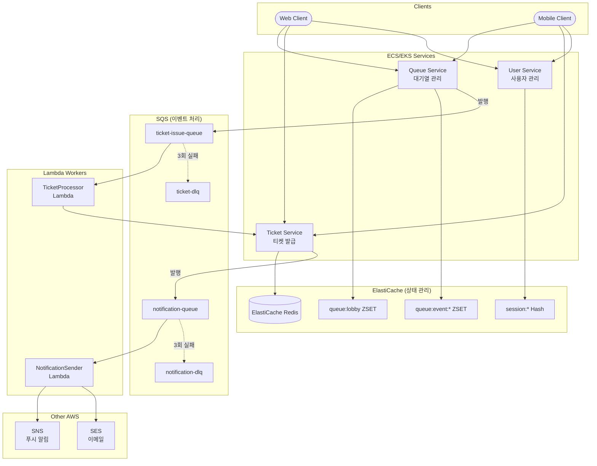
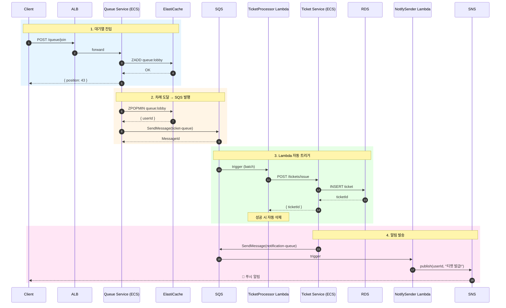
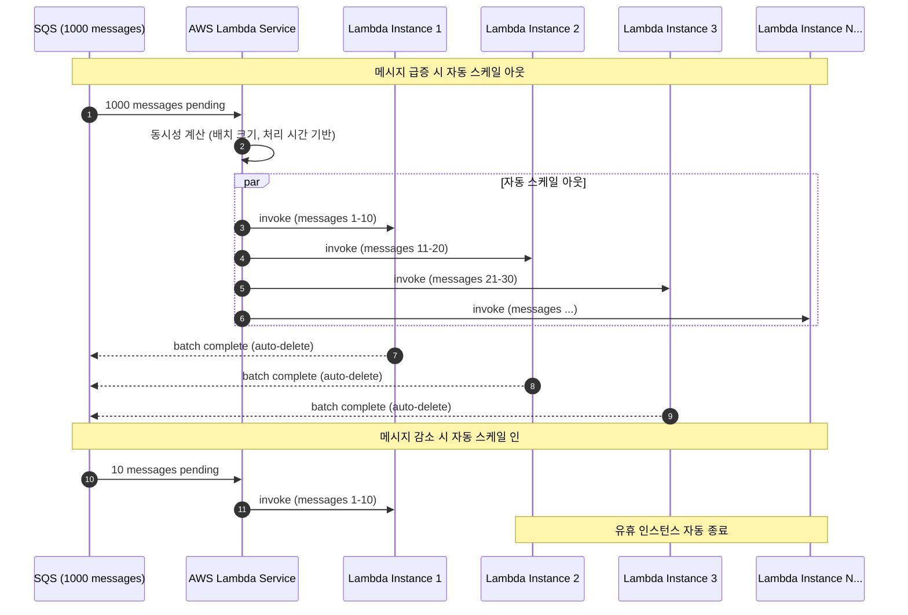
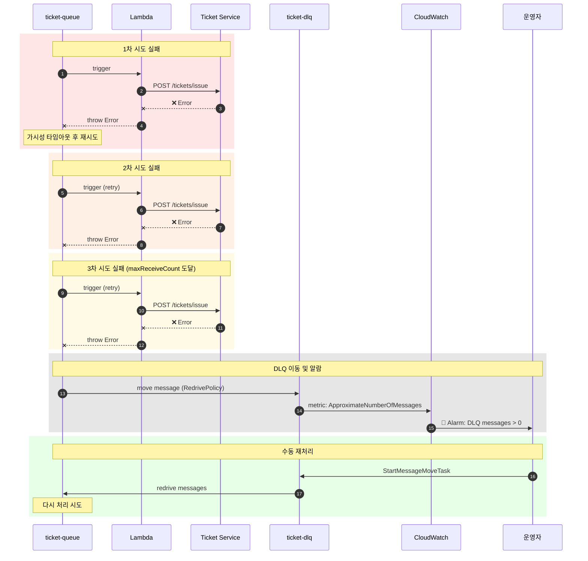
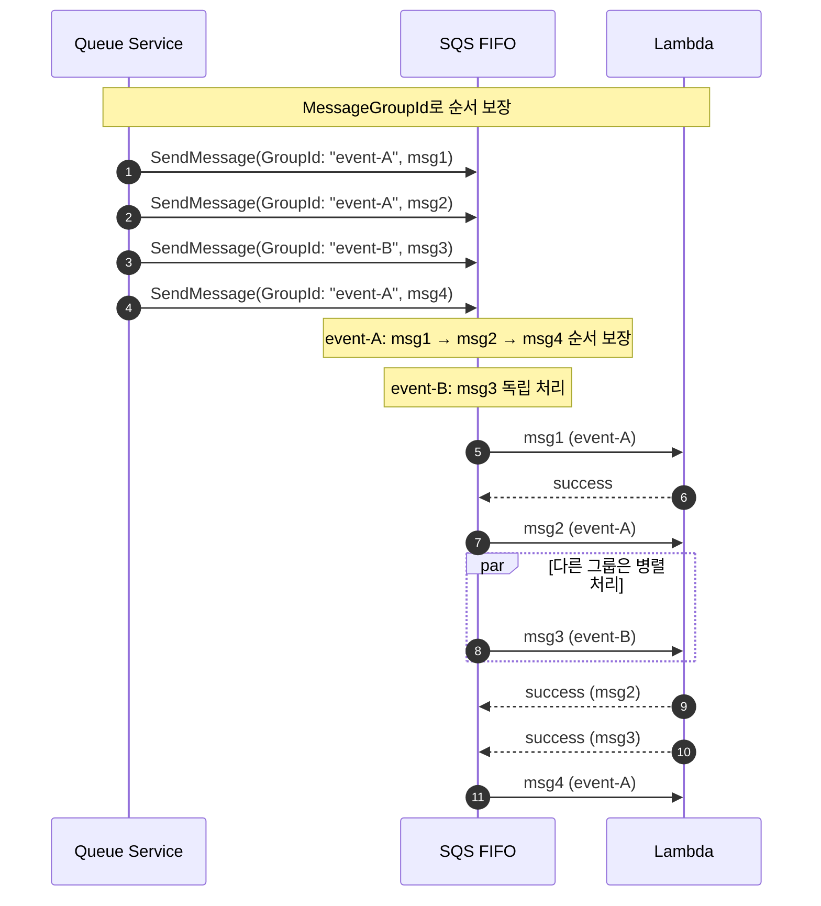
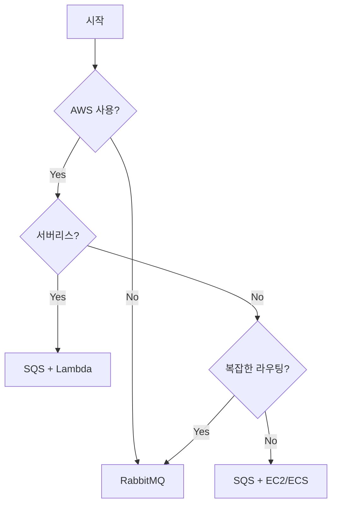

# Redis + AWS SQS 클라우드 네이티브

Redis ZSET과 AWS SQS를 결합한 완전 관리형 클라우드 네이티브 아키텍처입니다.

## 개요



### 다중 서비스 구조
- **Queue Service**: ElastiCache ZSET 관리 + SQS 이벤트 발행
- **Ticket Service**: RDS에 티켓 저장 + 알림 이벤트 발행
- **Lambda Workers**: SQS 트리거로 자동 스케일링
- **SNS/SES**: 푸시 알림, 이메일 발송 통합

## 시퀀스 다이어그램

### 대기열 진입 → Lambda 처리 → 알림 전체 흐름



### Lambda 동시성 자동 스케일링



### DLQ 및 재처리 흐름



### FIFO 큐 순서 보장



## AWS SQS란?

- **Simple Queue Service**: AWS의 완전 관리형 메시지 큐 서비스
- **서버리스**: 인프라 관리 불필요
- **자동 확장**: 트래픽에 따라 자동 스케일링
- **고가용성**: 99.999999999% (11 9's) 내구성

## 장점

| 장점 | 설명 |
|------|------|
| 🔧 **완전 관리형** | 서버 프로비저닝, 패치, 모니터링 불필요 |
| 📈 **무제한 확장** | 초당 수백만 메시지 처리 가능 |
| 💰 **종량제** | 사용한 만큼만 비용 지불 |
| 🔒 **보안** | IAM, KMS 암호화, VPC 엔드포인트 |
| 🔢 **FIFO 지원** | 정확한 순서 보장 옵션 |
| ⏰ **지연 큐** | 메시지 지연 전송 기능 |
| 👁️ **가시성 타임아웃** | 중복 처리 방지 |

## 단점

| 단점 | 설명 |
|------|------|
| ☁️ **AWS 종속** | 다른 클라우드 이전 어려움 |
| 🌐 **네트워크 지연** | 로컬 대비 지연 시간 증가 |
| 💵 **비용 예측** | 트래픽 변동 시 비용 예측 어려움 |
| 🔀 **라우팅 제한** | RabbitMQ 대비 단순한 라우팅 |
| 📊 **메트릭 지연** | CloudWatch 메트릭 1분 지연 |

## SQS vs RabbitMQ

| 항목 | SQS | RabbitMQ |
|------|-----|----------|
| 관리 | 완전 관리형 | 자체 운영 |
| 확장성 | 무제한 | 수동 확장 |
| 비용 | 종량제 | 서버 비용 |
| 라우팅 | 단순 | 복잡한 패턴 |
| 지연 시간 | 수십 ms | 수 ms |
| 프로토콜 | HTTP/HTTPS | AMQP |
| DLQ | 기본 지원 | 설정 필요 |

## 사용 사례

### ✅ 적합한 경우
- AWS 기반 인프라
- 서버리스 아키텍처 (Lambda)
- 대규모 분산 시스템
- 인프라 관리 리소스 부족
- 빠른 확장이 필요한 경우

### ❌ 부적합한 경우
- 멀티 클라우드 전략
- 극도로 낮은 지연 시간 필요
- 복잡한 메시지 라우팅 필요
- 온프레미스 환경

## SQS 큐 타입

### Standard Queue
```
- 최대 처리량 (무제한)
- 최소 1회 전달 (중복 가능)
- 최선 노력 순서 (순서 보장 X)
```

### FIFO Queue
```
- 초당 3,000 메시지 (배치 시 30,000)
- 정확히 1회 전달
- 엄격한 순서 보장
- 메시지 그룹 ID로 파티셔닝
```

## 구현 예시

### SQS 클라이언트 설정
```typescript
import { SQSClient, SendMessageCommand, ReceiveMessageCommand } from '@aws-sdk/client-sqs';

const sqsClient = new SQSClient({
  region: process.env.AWS_REGION || 'ap-northeast-2',
  // LocalStack 사용 시
  ...(process.env.AWS_ENDPOINT && {
    endpoint: process.env.AWS_ENDPOINT,
    credentials: {
      accessKeyId: 'test',
      secretAccessKey: 'test'
    }
  })
});
```

### 메시지 발행
```typescript
class SQSQueueService {
  private queueUrl: string;

  async publishTicketEvent(userId: string, eventId: string): Promise<void> {
    const command = new SendMessageCommand({
      QueueUrl: this.queueUrl,
      MessageBody: JSON.stringify({
        userId,
        eventId,
        timestamp: Date.now()
      }),
      // FIFO 큐 사용 시
      MessageGroupId: eventId,
      MessageDeduplicationId: `${userId}-${Date.now()}`
    });

    await sqsClient.send(command);
  }
}
```

### 메시지 수신 (Polling)
```typescript
async pollMessages(): Promise<void> {
  const command = new ReceiveMessageCommand({
    QueueUrl: this.queueUrl,
    MaxNumberOfMessages: 10,
    WaitTimeSeconds: 20,  // Long Polling
    VisibilityTimeout: 30
  });

  const response = await sqsClient.send(command);
  
  for (const message of response.Messages || []) {
    try {
      const data = JSON.parse(message.Body!);
      await this.processTicket(data);
      await this.deleteMessage(message.ReceiptHandle!);
    } catch (error) {
      // 가시성 타임아웃 후 자동 재시도
      logger.error('Failed to process message', error);
    }
  }
}
```

### Lambda 트리거 (서버리스)
```typescript
// Lambda 핸들러
export const handler = async (event: SQSEvent): Promise<void> => {
  for (const record of event.Records) {
    const data = JSON.parse(record.body);
    
    try {
      await ticketService.issue(data.userId);
      // Lambda는 성공 시 자동으로 메시지 삭제
    } catch (error) {
      // 에러 throw 시 메시지가 DLQ로 이동
      throw error;
    }
  }
};
```

## LocalStack으로 로컬 개발

### docker-compose.yml
```yaml
localstack:
  image: localstack/localstack:latest
  ports:
    - "4566:4566"
  environment:
    - SERVICES=sqs
    - DEBUG=1
```

### 큐 생성 스크립트
```bash
# Standard Queue
aws --endpoint-url=http://localhost:4566 sqs create-queue \
  --queue-name ticket-issue-queue

# FIFO Queue
aws --endpoint-url=http://localhost:4566 sqs create-queue \
  --queue-name ticket-issue-queue.fifo \
  --attributes FifoQueue=true,ContentBasedDeduplication=true

# DLQ 설정
aws --endpoint-url=http://localhost:4566 sqs create-queue \
  --queue-name ticket-dlq

aws --endpoint-url=http://localhost:4566 sqs set-queue-attributes \
  --queue-url http://localhost:4566/000000000000/ticket-issue-queue \
  --attributes '{
    "RedrivePolicy": "{\"deadLetterTargetArn\":\"arn:aws:sqs:us-east-1:000000000000:ticket-dlq\",\"maxReceiveCount\":\"3\"}"
  }'
```

## 비용 최적화

| 전략 | 설명 |
|------|------|
| Long Polling | WaitTimeSeconds=20으로 API 호출 감소 |
| 배치 처리 | SendMessageBatch로 최대 10개 묶어서 전송 |
| FIFO 배치 | 높은 처리량 모드로 비용 절감 |
| 메시지 압축 | 큰 메시지는 S3에 저장하고 참조만 전달 |

## 모니터링 (CloudWatch)

| 메트릭 | 설명 |
|--------|------|
| ApproximateNumberOfMessages | 큐에 대기 중인 메시지 수 |
| ApproximateAgeOfOldestMessage | 가장 오래된 메시지 나이 |
| NumberOfMessagesSent | 전송된 메시지 수 |
| NumberOfMessagesReceived | 수신된 메시지 수 |
| NumberOfMessagesDeleted | 삭제된 메시지 수 |

## 아키텍처 선택 가이드



## 다음 단계

대용량 이벤트 스트리밍이 필요하다면 Kafka 아키텍처를 살펴보세요.
→ [Redis + Kafka 아키텍처](04-redis-kafka.md)


## ⚠️ 운영 레벨 위험 상황

### 1. 가시성 타임아웃 문제

**상황**: 메시지 처리 시간이 가시성 타임아웃보다 길어 중복 처리 발생

**증상**:
- 같은 티켓이 여러 번 발급됨
- 중복 결제/알림
- 데이터 정합성 깨짐

**원인**:
- VisibilityTimeout이 너무 짧음
- 처리 로직이 예상보다 오래 걸림
- 외부 API 지연

**대응**:
```typescript
// 처리 중 타임아웃 연장
const extendVisibility = async (receiptHandle: string) => {
  await sqs.send(new ChangeMessageVisibilityCommand({
    QueueUrl: queueUrl,
    ReceiptHandle: receiptHandle,
    VisibilityTimeout: 60  // 60초 연장
  }));
};
```

**예방**:
```typescript
// 충분한 타임아웃 설정
await sqs.send(new ReceiveMessageCommand({
  QueueUrl: queueUrl,
  VisibilityTimeout: 300  // 5분

// 멱등성 보장
const processTicket = async (userId: string) => {
  const existing = await db.findTicket(userId);
  if (existing) return existing;  // 이미 발급됨
  return await db.createTicket(userId);
};
```


---

### 2. DLQ 메시지 적체

**상황**: Dead Letter Queue에 실패 메시지가 계속 쌓임

**증상**:
- DLQ 메시지 수 증가
- 처리되지 않은 티켓 요청 누적
- 고객 클레임

**원인**:
- 버그로 인한 지속적 처리 실패
- 외부 서비스 장애
- 잘못된 메시지 형식

**대응**:
```bash
# DLQ 메시지 수 확인
aws sqs get-queue-attributes \
  --queue-url $DLQ_URL \
  --attribute-names ApproximateNumberOfMessages

# DLQ 메시지 샘플 확인
aws sqs receive-message --queue-url $DLQ_URL --max-number-of-messages 10
```

**예방**:
```typescript
// DLQ 모니터링 알람 설정
const alarm = new cloudwatch.Alarm({
  alarmName: 'DLQ-Messages-High',
  metric: dlqQueue.metricApproximateNumberOfMessagesVisible(),
  threshold: 10,
  evaluationPeriods: 1
});

// DLQ 재처리 Lambda
export const redriveHandler = async () => {
  const messages = await receiveDLQMessages();
  for (const msg of messages) {
    await mainQueue.sendMessage(msg.Body);  // 메인 큐로 재전송
    await dlq.deleteMessage(msg.ReceiptHandle);
  }
};
```

---

### 3. 처리량 한계 도달 (FIFO)

**상황**: FIFO 큐의 초당 처리량 한계 도달

```
# 에러
AWS.SimpleQueueService.Throttling: Rate exceeded
```

**증상**:
- SendMessage 요청 실패
- 메시지 발행 지연
- 503 에러 증가

**원인**:
- FIFO 큐 한계: 초당 300 TPS (배치 시 3,000)
- 트래픽 급증
- MessageGroupId 분산 미흡

**대응**:
```bash
# 현재 처리량 확인 (CloudWatch)
aws cloudwatch get-metric-statistics \
  --namespace AWS/SQS \
  --metric-name NumberOfMessagesSent \
  --dimensions Name=QueueName,Value=ticket-queue.fifo \
  --period 60 --statistics Sum
```

**예방**:
```typescript
// 높은 처리량 모드 활성화
await sqs.send(new SetQueueAttributesCommand({
  QueueUrl: queueUrl,
  Attributes: {
    'DeduplicationScope': 'messageGroup',
    'FifoThroughputLimit': 'perMessageGroupId'
  }
}));

// MessageGroupId 분산
const groupId = `event-${eventId}-${userId.slice(0, 2)}`;
await sqs.send(new SendMessageCommand({
  MessageGroupId: groupId  // 분산된 그룹 ID
}));
```

---

### 4. 비용 폭증

**상황**: 예상치 못한 SQS 비용 급증

**증상**:
- AWS 청구서 급증
- 비용 알람 발생

**원인**:
- 빈 응답 폴링 (Short Polling)
- 불필요한 API 호출
- 메시지 크기 초과로 S3 사용
- DDoS 또는 버그로 인한 대량 발행

**대응**:
```bash
# API 호출 수 확인
aws cloudwatch get-metric-statistics \
  --namespace AWS/SQS \
  --metric-name NumberOfEmptyReceives \
  --period 3600 --statistics Sum
```

**예방**:
```typescript
// Long Polling 필수 사용
await sqs.send(new ReceiveMessageCommand({
  QueueUrl: queueUrl,
  WaitTimeSeconds: 20,  // Long Polling (최대 20초)
  MaxNumberOfMessages: 10  // 배치 수신
}));

// 배치 전송으로 API 호출 감소
await sqs.send(new SendMessageBatchCommand({
  QueueUrl: queueUrl,
  Entries: messages.map((msg, i) => ({
    Id: `msg-${i}`,
    MessageBody: JSON.stringify(msg)
  }))
}));
```

---

### 5. IAM 권한 문제

**상황**: Lambda 또는 EC2가 SQS 접근 권한 없음

```
# 에러
AccessDenied: User is not authorized to perform: sqs:SendMessage
```

**증상**:
- 메시지 발행/수신 실패
- 배포 후 갑자기 동작 안 함
- 특정 환경에서만 실패

**원인**:
- IAM 정책 누락
- 리소스 ARN 오타
- 크로스 계정 권한 미설정
- VPC 엔드포인트 정책

**대응**:
```bash
# 현재 권한 확인
aws iam simulate-principal-policy \
  --policy-source-arn arn:aws:iam::123456789:role/lambda-role \
  --action-names sqs:SendMessage \
  --resource-arns arn:aws:sqs:ap-northeast-2:123456789:ticket-queue
```

**예방**:
```json
// 최소 권한 IAM 정책
{
  "Version": "2012-10-17",
  "Statement": [{
    "Effect": "Allow",
    "Action": [
      "sqs:SendMessage",
      "sqs:ReceiveMessage",
      "sqs:DeleteMessage",
      "sqs:GetQueueAttributes"
    ],
    "Resource": "arn:aws:sqs:ap-northeast-2:*:ticket-*"
  }]
}
```

---

### 6. 메시지 순서 보장 실패

**상황**: Standard 큐에서 순서가 뒤바뀜

**증상**:
- 나중에 들어온 사용자가 먼저 처리됨
- 대기열 순서 불일치
- 고객 불만

**원인**:
- Standard 큐는 순서 보장 안 함
- 여러 Consumer가 병렬 처리
- 재시도로 인한 순서 변경

**대응**:
```typescript
// 애플리케이션 레벨 순서 검증
const processMessage = async (msg: Message) => {
  const data = JSON.parse(msg.Body);
  const position = await redis.zRank('queue:lobby', data.userId);
  
  if (position !== 0) {
    // 아직 차례가 아님 - 다시 큐에 넣기
    await sqs.send(new SendMessageCommand({
      QueueUrl: queueUrl,
      MessageBody: msg.Body,
      DelaySeconds: 5
    }));
    return;
  }
  
  await processTicket(data);
};
```

**예방**:
```typescript
// FIFO 큐 사용 (순서 보장 필요 시)
const queueUrl = 'https://sqs.../ticket-queue.fifo';

await sqs.send(new SendMessageCommand({
  QueueUrl: queueUrl,
  MessageBody: JSON.stringify(data),
  MessageGroupId: 'ticket-processing',  // 같은 그룹 내 순서 보장
  MessageDeduplicationId: `${userId}-${timestamp}`
}));
```

---

### 7. Lambda 동시성 한계

**상황**: SQS 트리거 Lambda의 동시 실행 한계 도달

**증상**:
- 메시지 처리 지연
- Lambda throttling 에러
- 큐에 메시지 적체

**원인**:
- 계정 동시성 한계 (기본 1,000)
- Reserved Concurrency 설정
- 다른 Lambda와 동시성 경쟁

**대응**:
```bash
# 현재 동시성 확인
aws lambda get-account-settings

# 동시성 한계 증가 요청
aws service-quotas request-service-quota-increase \
  --service-code lambda \
  --quota-code L-B99A9384 \
  --desired-value 3000
```

**예방**:
```typescript
// Reserved Concurrency 설정
new lambda.Function(this, 'TicketProcessor', {
  reservedConcurrentExecutions: 100,  // 전용 동시성 확보
});

// SQS 배치 크기 조정
new lambdaEventSources.SqsEventSource(queue, {
  batchSize: 10,
  maxBatchingWindow: Duration.seconds(5)
});
```

---

### 8. Redis-SQS 동기화 실패

**상황**: Redis에서 제거됐지만 SQS 발행 실패

**증상**:
- 사용자가 대기열에서 사라짐
- 티켓 미발급
- 데이터 불일치

**원인**:
- 네트워크 타임아웃
- SQS 서비스 장애
- IAM 권한 만료

**대응**:
```typescript
// 고아 사용자 탐지 및 복구
const findOrphanedUsers = async (): Promise<string[]> => {
  const recentlyRemoved = await redis.zRange('queue:removed', 0, -1);
  const processed = await db.getProcessedUsers(recentlyRemoved);
  return recentlyRemoved.filter(u => !processed.includes(u));
};

// 복구 실행
const orphaned = await findOrphanedUsers();
for (const userId of orphaned) {
  await sqs.send(new SendMessageCommand({
    QueueUrl: queueUrl,
    MessageBody: JSON.stringify({ userId, isRecovery: true })
  }));
}
```

**예방**:
```typescript
// Outbox 패턴 사용
const processUser = async (userId: string): Promise<void> => {
  // 1. DB에 outbox 레코드 생성 (트랜잭션)
  await db.transaction(async (tx) => {
    await tx.insert('outbox', {
      id: uuid(),
      payload: JSON.stringify({ userId }),
      status: 'pending'
    });
    await tx.execute('DELETE FROM queue WHERE user_id = ?', [userId]);
  });
  
  // 2. 별도 프로세스가 outbox → SQS 발행
  // 실패해도 outbox에 남아있어 재시도 가능
};
```

---

### 운영 체크리스트

| 항목 | 확인 |
|------|------|
| Long Polling 설정 (WaitTimeSeconds=20) | ☐ |
| DLQ 설정 및 모니터링 | ☐ |
| 가시성 타임아웃 적절히 설정 | ☐ |
| 멱등성 처리 구현 | ☐ |
| IAM 최소 권한 원칙 | ☐ |
| FIFO vs Standard 선택 검토 | ☐ |
| Lambda 동시성 설정 | ☐ |
| 비용 알람 설정 | ☐ |
| CloudWatch 대시보드 | ☐ |
| Redis-SQS 동기화 로직 | ☐ |
| 장애 복구 절차 문서화 | ☐ |
