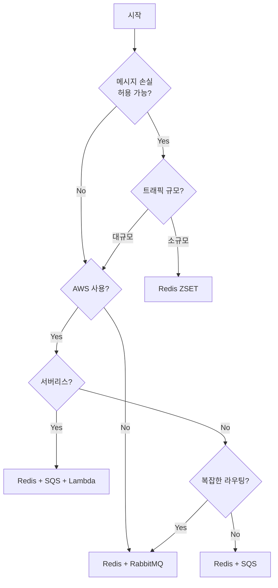

# 아키텍처 비교 가이드

세 가지 큐 아키텍처의 특성을 비교하고 상황에 맞는 선택을 도와드립니다.

## 한눈에 비교

| 항목 | Redis ZSET | Redis + RabbitMQ | Redis + SQS |
|------|------------|------------------|-------------|
| 복잡도 | ⭐ | ⭐⭐⭐ | ⭐⭐ |
| 신뢰성 | ⭐⭐ | ⭐⭐⭐⭐ | ⭐⭐⭐⭐⭐ |
| 확장성 | ⭐⭐ | ⭐⭐⭐ | ⭐⭐⭐⭐⭐ |
| 지연시간 | ⭐⭐⭐⭐⭐ | ⭐⭐⭐⭐ | ⭐⭐⭐ |
| 운영비용 | ⭐⭐⭐⭐⭐ | ⭐⭐⭐ | ⭐⭐⭐⭐ |
| 학습곡선 | ⭐⭐⭐⭐⭐ | ⭐⭐⭐ | ⭐⭐⭐⭐ |

## 기능 비교

| 기능 | Redis ZSET | RabbitMQ | SQS |
|------|------------|----------|-----|
| 실시간 위치 조회 | ✅ | ❌ | ❌ |
| 메시지 영속성 | ⚠️ | ✅ | ✅ |
| Dead Letter Queue | ❌ | ✅ | ✅ |
| 메시지 라우팅 | ❌ | ✅ | ⚠️ |
| 자동 확장 | ❌ | ❌ | ✅ |
| 관리형 서비스 | ❌ | ❌ | ✅ |
| FIFO 보장 | ✅ | ✅ | ✅ |
| 중복 제거 | ✅ | ⚠️ | ✅ |


## 선택 가이드

### Redis ZSET만 사용
```
✅ 선택 조건:
- 빠른 프로토타이핑
- 소규모 트래픽 (< 10,000 TPS)
- 메시지 손실 허용 가능
- 단순한 FIFO 대기열
- 실시간 위치 표시가 핵심

❌ 피해야 할 경우:
- 메시지 손실 불가
- 복잡한 비동기 처리
- 대규모 확장 필요
```

### Redis + RabbitMQ
```
✅ 선택 조건:
- 온프레미스 또는 멀티클라우드
- 복잡한 메시지 라우팅 필요
- 세밀한 제어 필요
- 팀에 RabbitMQ 경험 있음

❌ 피해야 할 경우:
- 인프라 관리 리소스 부족
- AWS 전용 환경
- 빠른 확장 필요
```

### Redis + AWS SQS
```
✅ 선택 조건:
- AWS 기반 인프라
- 서버리스 아키텍처
- 인프라 관리 최소화
- 대규모 확장 필요
- Lambda 트리거 활용

❌ 피해야 할 경우:
- 멀티클라우드 전략
- 극도로 낮은 지연시간
- 복잡한 라우팅 패턴
```

## 의사결정 플로우차트



## 비용 비교 (월간 추정)

### 소규모 (1만 메시지/일)
| 아키텍처 | 예상 비용 |
|----------|-----------|
| Redis ZSET | ~$15 (t3.micro) |
| + RabbitMQ | ~$30 (추가 인스턴스) |
| + SQS | ~$16 (거의 무료) |

### 중규모 (100만 메시지/일)
| 아키텍처 | 예상 비용 |
|----------|-----------|
| Redis ZSET | ~$50 (t3.small) |
| + RabbitMQ | ~$100 (m5.large) |
| + SQS | ~$70 (SQS 비용 포함) |

### 대규모 (1억 메시지/일)
| 아키텍처 | 예상 비용 |
|----------|-----------|
| Redis ZSET | 확장 한계 |
| + RabbitMQ | ~$500+ (클러스터) |
| + SQS | ~$400 (자동 확장) |

## 마이그레이션 경로

```
Redis ZSET
    ↓ (신뢰성 필요)
Redis + RabbitMQ
    ↓ (AWS 전환)
Redis + SQS
```

### 마이그레이션 팁
1. **인터페이스 추상화**: Queue Adapter 패턴 사용
2. **점진적 전환**: 새 기능부터 새 아키텍처 적용
3. **듀얼 라이트**: 전환 기간 동안 양쪽에 기록
4. **롤백 계획**: 문제 시 빠른 복구 방안 준비

## 결론

| 상황 | 추천 |
|------|------|
| 학습/프로토타입 | Redis ZSET |
| 프로덕션 (온프레미스) | Redis + RabbitMQ |
| 프로덕션 (AWS) | Redis + SQS |
| 서버리스 | Redis + SQS + Lambda |

각 아키텍처의 상세 내용은 개별 가이드를 참조하세요:
- [Redis ZSET](01-redis-zset.md)
- [Redis + RabbitMQ](02-redis-rabbitmq.md)
- [Redis + SQS](03-redis-sqs.md)


## ⚠️ 운영 위험 비교

### 장애 유형별 비교

| 장애 유형 | Redis ZSET | Redis + RabbitMQ | Redis + SQS |
|-----------|------------|------------------|-------------|
| 메모리 고갈 | 🔴 치명적 | 🟡 부분 영향 | 🟢 SQS 무관 |
| 서버 다운 | 🔴 전체 마비 | 🟡 부분 복구 | 🟢 자동 복구 |
| 데이터 유실 | 🔴 높음 | 🟡 중간 | 🟢 낮음 |
| 실수 삭제 | 🔴 복구 어려움 | 🟡 정의 백업 | 🟢 자동 보존 |
| 네트워크 단절 | 🔴 즉시 장애 | 🟡 파티션 위험 | 🟢 재시도 |
| 처리량 초과 | 🟡 느려짐 | 🟡 블로킹 | 🟡 쓰로틀링 |

### 복구 난이도

| 상황 | Redis ZSET | RabbitMQ | SQS |
|------|------------|----------|-----|
| 서비스 재시작 | 쉬움 | 중간 | 불필요 |
| 데이터 복구 | 어려움 | 중간 | 쉬움 |
| 설정 복원 | 수동 | 정의 파일 | 자동 |
| 장애 원인 분석 | 어려움 | 중간 | 쉬움 (CloudWatch) |

### 운영 복잡도

```
Redis ZSET     ████░░░░░░  낮음 (단일 시스템)
+ RabbitMQ     ████████░░  높음 (두 시스템 + 동기화)
+ SQS          ██████░░░░  중간 (관리형이지만 AWS 지식 필요)
```

### 미션 크리티컬 시스템 권장사항

| 요구사항 | 권장 아키텍처 |
|----------|---------------|
| 99.9% 가용성 | Redis Cluster + SQS |
| 99.99% 가용성 | ElastiCache + SQS + Multi-AZ |
| 데이터 무손실 | SQS FIFO + DLQ |
| 빠른 복구 | SQS (자동 복구) |
| 감사 추적 | SQS + CloudTrail |

### 장애 대응 시간 비교

| 장애 | Redis ZSET | RabbitMQ | SQS |
|------|------------|----------|-----|
| 서버 다운 | 수동 복구 (분~시간) | Failover (분) | 자동 (초) |
| 메모리 부족 | 수동 정리 (분) | 자동 블로킹 | 해당 없음 |
| 디스크 부족 | 수동 정리 (분) | 자동 블로킹 | 해당 없음 |
| 설정 오류 | 재배포 (분) | 재설정 (분) | 콘솔 수정 (초) |
