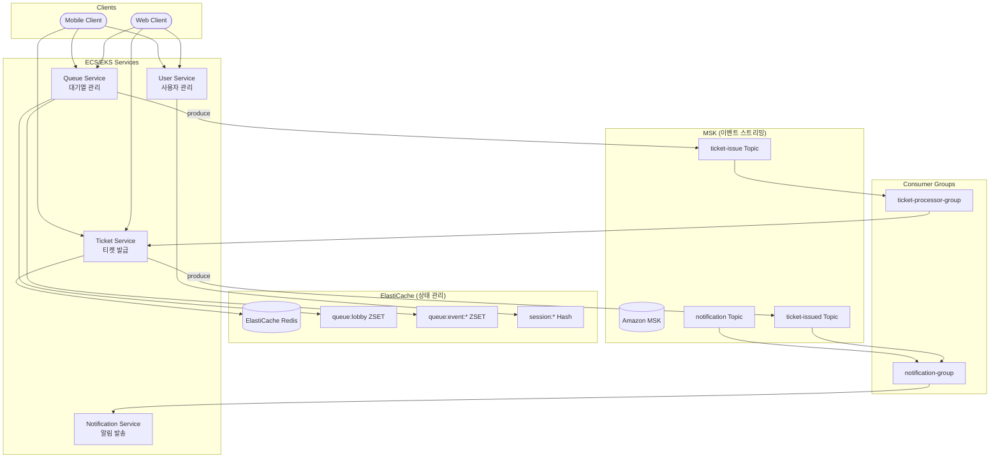
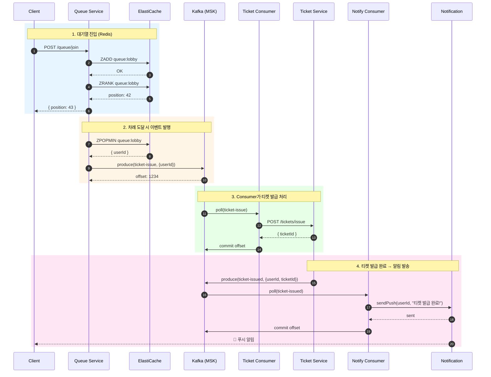
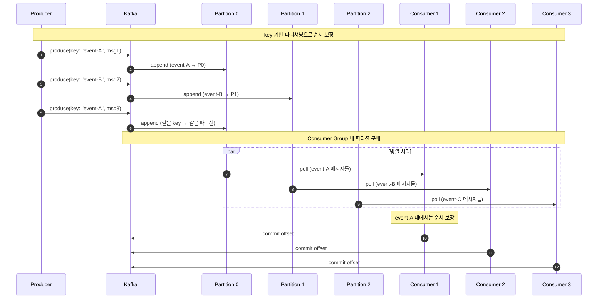
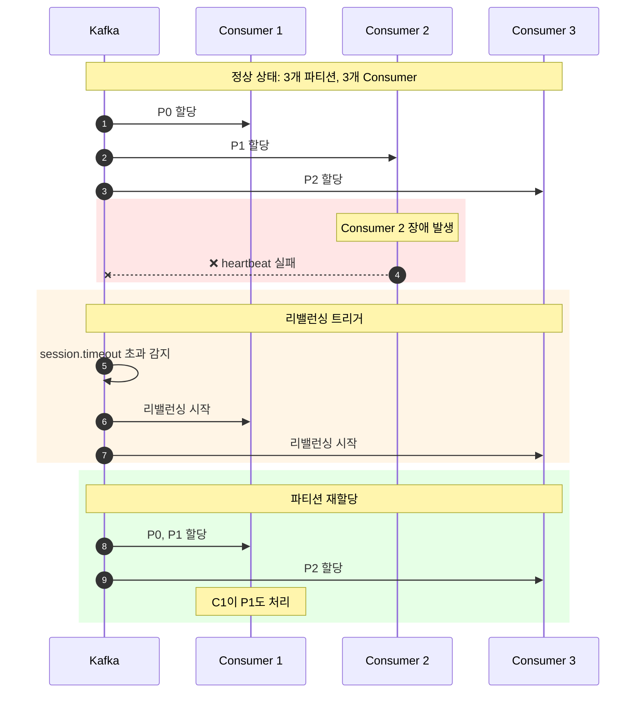
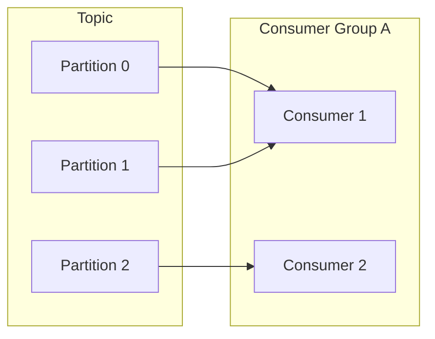

# Redis + Kafka 이벤트 스트리밍

Redis ZSET의 실시간 위치 추적과 Apache Kafka의 고성능 이벤트 스트리밍을 결합한 아키텍처입니다.

## 개요



### 다중 서비스 구조
- **Queue Service**: ElastiCache ZSET 관리 + Kafka 이벤트 발행
- **Ticket Service**: 티켓 발급 + 발급 완료 이벤트 발행
- **Consumer Groups**: 토픽별 Consumer Group이 메시지 처리
- **Notification Service**: 알림 토픽 구독하여 푸시/이메일 발송

## 시퀀스 다이어그램

### 대기열 진입 → 티켓 발급 → 알림 전체 흐름



### 파티션 기반 병렬 처리



### Consumer 장애 시 리밸런싱



## Apache Kafka란?

- **분산 이벤트 스트리밍 플랫폼**: LinkedIn에서 개발, Apache 재단 오픈소스
- **고성능**: 초당 수백만 메시지 처리 가능
- **내구성**: 디스크 기반 저장으로 메시지 영속성 보장
- **확장성**: 파티션 기반 수평 확장

## 역할 분담

### ElastiCache (Redis ZSET)
| 역할 | 설명 |
|------|------|
| 📍 위치 추적 | 사용자의 실시간 대기 위치 |
| 🔢 순서 관리 | FIFO 순서 보장 |
| 🔍 상태 조회 | 빠른 위치/크기 조회 |
| 🚫 중복 방지 | 같은 사용자 중복 진입 차단 |

### Kafka (MSK)
| 역할 | 설명 |
|------|------|
| 📬 이벤트 스트리밍 | 대용량 이벤트 처리 |
| ⚖️ 파티션 병렬 처리 | Consumer Group 기반 부하 분산 |
| 📚 메시지 보존 | 설정된 기간 동안 메시지 보관 |
| 🔄 재처리 가능 | offset 조정으로 과거 메시지 재처리 |

## 장점

| 장점 | 설명 |
|------|------|
| ⚡ **초고성능** | 초당 수백만 메시지 처리 |
| 📚 **메시지 보존** | 설정 기간 동안 모든 메시지 보관 |
| 🔄 **재처리 가능** | offset 조정으로 과거 이벤트 재처리 |
| ⚖️ **수평 확장** | 파티션 추가로 처리량 증가 |
| 🔗 **이벤트 소싱** | 이벤트 기반 아키텍처에 적합 |
| 📊 **스트림 처리** | Kafka Streams, ksqlDB 연동 |

## 단점

| 단점 | 설명 |
|------|------|
| 🏗️ **운영 복잡도** | Zookeeper/KRaft, 브로커 관리 |
| 📚 **학습 곡선** | 파티션, Consumer Group 등 개념 학습 |
| 💰 **인프라 비용** | 최소 3개 브로커 권장 |
| ⏱️ **지연 시간** | RabbitMQ 대비 약간 높은 지연 |
| 🔧 **설정 복잡** | 튜닝 파라미터가 많음 |

## 사용 사례

### ✅ 적합한 경우
- 대규모 이벤트 스트리밍
- 이벤트 소싱 아키텍처
- 실시간 데이터 파이프라인
- 로그 수집/분석
- 마이크로서비스 간 비동기 통신
- 메시지 재처리가 필요한 경우

### ❌ 부적합한 경우
- 소규모 시스템 (오버엔지니어링)
- 단순한 작업 큐
- 극도로 낮은 지연 시간 필요 (<1ms)
- 운영 인력/경험 부족

## Kafka 핵심 개념

### 토픽과 파티션
```
Topic: ticket-issue
├── Partition 0: [msg1, msg4, msg7, ...]
├── Partition 1: [msg2, msg5, msg8, ...]
└── Partition 2: [msg3, msg6, msg9, ...]
```

### Consumer Group


### Offset 관리
```
Partition 0: [0, 1, 2, 3, 4, 5, 6, 7, 8, 9]
                          ↑
                    committed offset
                    (Consumer가 처리 완료한 위치)
```

## 구현 예시

### Producer (Queue Service)
```typescript
import { Kafka, Producer } from 'kafkajs';

class KafkaQueueService {
  private producer: Producer;

  async publishTicketEvent(userId: string, eventId: string): Promise<void> {
    await this.producer.send({
      topic: 'ticket-issue',
      messages: [{
        key: eventId,  // 같은 이벤트는 같은 파티션으로
        value: JSON.stringify({
          userId,
          eventId,
          timestamp: Date.now()
        })
      }]
    });
  }
}
```

### Consumer (Worker)
```typescript
import { Kafka, Consumer, EachMessagePayload } from 'kafkajs';

class TicketConsumer {
  private consumer: Consumer;

  async start(): Promise<void> {
    await this.consumer.subscribe({ 
      topic: 'ticket-issue',
      fromBeginning: false 
    });

    await this.consumer.run({
      eachMessage: async ({ topic, partition, message }: EachMessagePayload) => {
        const data = JSON.parse(message.value!.toString());
        
        try {
          // 티켓 발급
          const ticket = await this.ticketService.issue(data.userId);
          
          // Socket.io 알림
          this.io.to(data.userId).emit('ticket:issued', ticket);
          
          // 자동 offset commit (autoCommit: true)
        } catch (error) {
          // 에러 시 offset commit 안 됨 → 재처리
          throw error;
        }
      }
    });
  }
}
```

## AWS MSK vs 자체 운영

| 항목 | Amazon MSK | 자체 운영 (EKS) |
|------|------------|-----------------|
| 관리 | AWS 관리형 | 직접 운영 |
| 비용 | 시간당 과금 | EC2/EKS 비용 |
| 확장 | 콘솔에서 브로커 추가 | 수동 확장 |
| 모니터링 | CloudWatch 통합 | Prometheus 등 별도 구성 |
| 버전 업그레이드 | AWS 지원 | 직접 수행 |
| Zookeeper | MSK가 관리 | 직접 운영 또는 KRaft |

## 환경별 구성

### 로컬 개발 (Docker Compose)
```yaml
# docker-compose.yml (--profile kafka)
zookeeper:
  image: confluentinc/cp-zookeeper:7.5.0
  
kafka:
  image: confluentinc/cp-kafka:7.5.0
  environment:
    KAFKA_ADVERTISED_LISTENERS: PLAINTEXT://kafka:29092,PLAINTEXT_HOST://localhost:9092

kafka-ui:
  image: provectuslabs/kafka-ui:latest
  ports:
    - "8082:8080"
```

### AWS 프로덕션 (MSK)
```typescript
const kafka = new Kafka({
  clientId: 'queue-service',
  brokers: [
    'b-1.msk-cluster.xxx.kafka.ap-northeast-2.amazonaws.com:9092',
    'b-2.msk-cluster.xxx.kafka.ap-northeast-2.amazonaws.com:9092',
    'b-3.msk-cluster.xxx.kafka.ap-northeast-2.amazonaws.com:9092'
  ],
  ssl: true,
  sasl: {
    mechanism: 'scram-sha-512',
    username: process.env.MSK_USERNAME!,
    password: process.env.MSK_PASSWORD!
  }
});
```

## 모니터링 포인트

| 메트릭 | 설명 | 임계값 예시 |
|--------|------|-------------|
| Consumer Lag | 처리 지연 메시지 수 | > 10,000 경고 |
| Messages In/Out | 초당 메시지 처리량 | 트래픽 패턴 확인 |
| Under Replicated Partitions | 복제 지연 파티션 | > 0 경고 |
| Request Latency | 요청 지연 시간 | > 100ms 경고 |
| Disk Usage | 브로커 디스크 사용량 | > 80% 경고 |

## 다음 단계

네 가지 아키텍처를 비교하고 상황에 맞는 선택을 해보세요.
→ [아키텍처 비교 가이드](05-comparison.md)


## ⚠️ 운영 레벨 위험 상황

### 1. Consumer Lag 급증

**상황**: Consumer 처리 속도가 Producer 발행 속도를 따라가지 못함

**증상**:
- Consumer Lag 메트릭 급증
- 메시지 처리 지연
- 사용자 티켓 발급 지연

**원인**:
- Consumer 수 부족
- 처리 로직 병목
- 외부 서비스 지연
- 파티션 수 대비 Consumer 부족

**대응**:
```bash
# Consumer Lag 확인
kafka-consumer-groups.sh --bootstrap-server kafka:9092 \
  --group ticket-processor-group --describe

# 특정 파티션 lag 확인
kafka-run-class.sh kafka.tools.GetOffsetShell \
  --broker-list kafka:9092 --topic ticket-issue
```

**예방**:
```typescript
// Consumer 수 증가 (파티션 수만큼)
// 파티션 3개 → Consumer 3개까지 병렬 처리 가능

// 배치 처리로 처리량 증가
await consumer.run({
  eachBatch: async ({ batch, resolveOffset, heartbeat }) => {
    for (const message of batch.messages) {
      await processMessage(message);
      resolveOffset(message.offset);
      await heartbeat();
    }
  }
});
```

---

### 2. 리밸런싱 폭풍 (Rebalancing Storm)

**상황**: Consumer Group이 계속 리밸런싱되어 처리 중단

**증상**:
- 잦은 "Rebalancing" 로그
- 메시지 처리 중단/재시작 반복
- 중복 처리 발생

**원인**:
- session.timeout.ms 너무 짧음
- heartbeat.interval.ms 설정 문제
- Consumer 처리 시간이 max.poll.interval.ms 초과
- 네트워크 불안정

**대응**:
```typescript
// 현재 리밸런싱 상태 확인
kafka-consumer-groups.sh --bootstrap-server kafka:9092 \
  --group ticket-processor-group --describe --state
```

**예방**:
```typescript
const consumer = kafka.consumer({
  groupId: 'ticket-processor-group',
  sessionTimeout: 30000,        // 30초 (기본 10초보다 여유있게)
  heartbeatInterval: 3000,      // 3초
  maxPollInterval: 300000,      // 5분 (긴 처리 허용)
  rebalanceTimeout: 60000       // 리밸런싱 타임아웃
});
```

---

### 3. 브로커 장애

**상황**: Kafka 브로커 노드 다운

**증상**:
- 특정 파티션 리더 없음
- Producer/Consumer 연결 실패
- Under Replicated Partitions 증가

**원인**:
- 서버 장애
- 디스크 풀
- OOM (Out of Memory)
- 네트워크 단절

**대응**:
```bash
# 클러스터 상태 확인
kafka-metadata.sh --snapshot /var/kafka-logs/__cluster_metadata-0/00000000000000000000.log --command "broker"

# 파티션 리더 확인
kafka-topics.sh --bootstrap-server kafka:9092 \
  --topic ticket-issue --describe

# Under Replicated Partitions 확인
kafka-topics.sh --bootstrap-server kafka:9092 \
  --describe --under-replicated-partitions
```

**예방**:
```bash
# 최소 3개 브로커 구성
# replication.factor=3
# min.insync.replicas=2

# 토픽 생성 시
kafka-topics.sh --create --topic ticket-issue \
  --partitions 6 \
  --replication-factor 3 \
  --config min.insync.replicas=2
```

---

### 4. 디스크 공간 부족

**상황**: 브로커 디스크 사용량 임계치 초과

**증상**:
- 새 메시지 저장 실패
- 브로커 비정상 종료
- Producer 에러

**원인**:
- retention.ms/bytes 설정 과다
- 트래픽 급증
- 로그 세그먼트 정리 지연

**대응**:
```bash
# 디스크 사용량 확인
df -h /var/kafka-logs

# 토픽별 사용량 확인
du -sh /var/kafka-logs/*

# 긴급: retention 줄이기
kafka-configs.sh --bootstrap-server kafka:9092 \
  --alter --entity-type topics --entity-name ticket-issue \
  --add-config retention.ms=3600000  # 1시간으로 축소
```

**예방**:
```bash
# 적절한 retention 설정
kafka-topics.sh --create --topic ticket-issue \
  --config retention.ms=86400000 \     # 1일
  --config retention.bytes=1073741824  # 1GB per partition

# 로그 압축 활성화 (필요시)
--config cleanup.policy=compact
```

---

### 5. 메시지 순서 깨짐

**상황**: 같은 사용자의 메시지가 순서대로 처리되지 않음

**증상**:
- 나중 요청이 먼저 처리됨
- 데이터 정합성 문제
- 비즈니스 로직 오류

**원인**:
- key 없이 메시지 발행 (라운드로빈)
- 여러 파티션에 분산
- 재시도로 인한 순서 변경

**대응**:
```typescript
// 메시지 순서 확인
const admin = kafka.admin();
const offsets = await admin.fetchTopicOffsets('ticket-issue');
console.log(offsets);
```

**예방**:
```typescript
// key 기반 파티셔닝으로 순서 보장
await producer.send({
  topic: 'ticket-issue',
  messages: [{
    key: eventId,  // 같은 이벤트 → 같은 파티션 → 순서 보장
    value: JSON.stringify(data)
  }]
});

// idempotent producer 활성화
const producer = kafka.producer({
  idempotent: true,
  maxInFlightRequests: 1  // 순서 보장 강화
});
```

---

### 6. 중복 메시지 처리

**상황**: 같은 메시지가 여러 번 처리됨

**증상**:
- 티켓 중복 발급
- 알림 중복 발송
- 데이터 중복

**원인**:
- Consumer 장애 후 재시작
- 리밸런싱 중 offset commit 실패
- at-least-once 특성

**대응**:
```typescript
// 중복 확인 후 처리
const processMessage = async (message: KafkaMessage) => {
  const data = JSON.parse(message.value!.toString());
  const messageId = `${message.topic}-${message.partition}-${message.offset}`;
  
  // 이미 처리된 메시지인지 확인
  const processed = await redis.get(`processed:${messageId}`);
  if (processed) {
    return; // 중복 스킵
  }
  
  await processTicket(data);
  
  // 처리 완료 마킹 (TTL 설정)
  await redis.set(`processed:${messageId}`, '1', 'EX', 86400);
};
```

**예방**:
```typescript
// 멱등성 보장
const issueTicket = async (userId: string): Promise<Ticket> => {
  // 이미 발급된 티켓 확인
  const existing = await db.findTicket({ userId, status: 'pending' });
  if (existing) return existing;
  
  return await db.createTicket({ userId });
};

// Exactly-once 설정 (Kafka Transactions)
const producer = kafka.producer({
  transactionalId: 'ticket-processor',
  idempotent: true
});
```

---

### 7. Zookeeper/KRaft 장애

**상황**: 메타데이터 관리 시스템 장애

**증상**:
- 브로커 리더 선출 불가
- 토픽/파티션 메타데이터 불일치
- 클러스터 전체 장애

**원인**:
- Zookeeper 쿼럼 손실
- 네트워크 파티션
- 디스크 장애

**대응**:
```bash
# Zookeeper 상태 확인
echo stat | nc localhost 2181

# KRaft 모드 상태 확인
kafka-metadata.sh --snapshot /var/kafka-logs/__cluster_metadata-0/00000000000000000000.log --command "quorum"
```

**예방**:
```bash
# Zookeeper 3노드 이상 구성
# KRaft 모드 사용 권장 (Kafka 3.3+)

# MSK 사용 시 AWS가 관리
```

---

### 8. Redis-Kafka 동기화 실패

**상황**: Redis에서 제거됐지만 Kafka 발행 실패

**증상**:
- 사용자가 대기열에서 사라짐
- 티켓 미발급
- 데이터 불일치

**원인**:
- Kafka 브로커 연결 실패
- 네트워크 타임아웃
- Producer 버퍼 풀

**대응**:
```typescript
// 고아 사용자 탐지 및 복구
const findOrphanedUsers = async (): Promise<string[]> => {
  const removed = await redis.sMembers('queue:removed:pending');
  const processed = await db.getProcessedUsers(removed);
  return removed.filter(u => !processed.includes(u));
};
```

**예방**:
```typescript
// Transactional Outbox 패턴
const processUser = async (userId: string): Promise<void> => {
  await db.transaction(async (tx) => {
    // 1. Outbox에 이벤트 저장
    await tx.insert('outbox', {
      topic: 'ticket-issue',
      key: userId,
      payload: JSON.stringify({ userId }),
      status: 'pending'
    });
    
    // 2. Redis에서 제거
    await redis.zRem('queue:lobby', userId);
  });
  
  // 3. 별도 프로세스가 outbox → Kafka 발행
};

// Outbox Relay 프로세스
const relayOutbox = async () => {
  const pending = await db.query('SELECT * FROM outbox WHERE status = ?', ['pending']);
  for (const event of pending) {
    await producer.send({
      topic: event.topic,
      messages: [{ key: event.key, value: event.payload }]
    });
    await db.update('outbox', { status: 'sent' }, { id: event.id });
  }
};
```

---

### 운영 체크리스트

| 항목 | 확인 |
|------|------|
| 최소 3개 브로커 구성 | ☐ |
| replication.factor >= 3 | ☐ |
| min.insync.replicas = 2 | ☐ |
| Consumer Group 모니터링 | ☐ |
| Consumer Lag 알람 설정 | ☐ |
| 디스크 사용량 알람 | ☐ |
| key 기반 파티셔닝 | ☐ |
| 멱등성 처리 구현 | ☐ |
| 적절한 retention 설정 | ☐ |
| session.timeout 튜닝 | ☐ |
| Redis-Kafka 동기화 로직 | ☐ |
| 장애 복구 절차 문서화 | ☐ |
