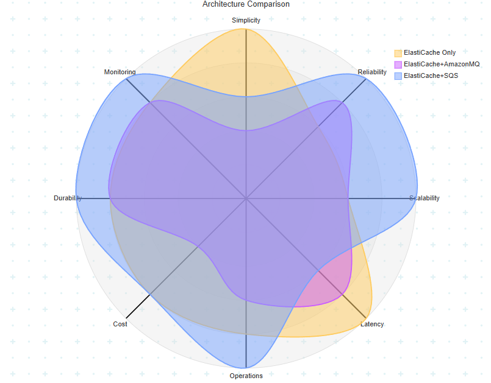
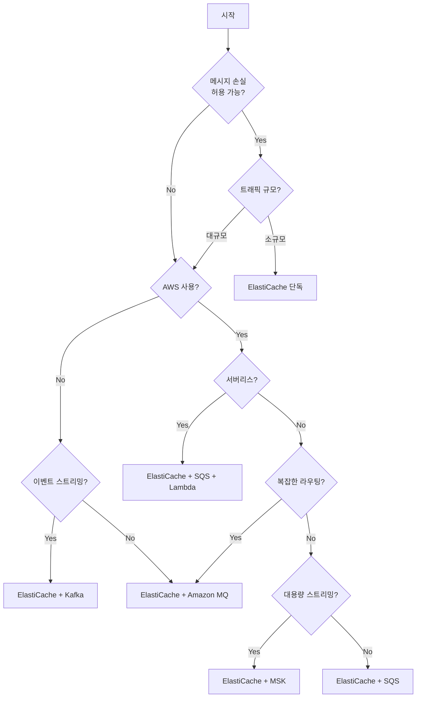

# 아키텍처 비교 가이드

네 가지 큐 아키텍처의 특성을 비교하고 상황에 맞는 선택을 도와드립니다.

> 💡 **비교 기준**: AWS 프로덕션 환경 (관리형 서비스 사용)  
> 로컬 개발 시에는 Docker로 Redis, RabbitMQ, Kafka를 사용하고, 프로덕션에서는 관리형 서비스로 전환합니다.

## 아키텍처별 특성 비교 (5점 만점)



| 평가 항목 | ElastiCache 단독 | ElastiCache + Amazon MQ | ElastiCache + SQS | ElastiCache + MSK |
|-----------|:----------------:|:-----------------------:|:-----------------:|:-----------------:|
| **구현 단순성** | ⭐⭐⭐⭐⭐ (5) | ⭐⭐ (2) | ⭐⭐⭐ (3) | ⭐⭐ (2) |
| **신뢰성** | ⭐⭐⭐ (3) | ⭐⭐⭐⭐ (4) | ⭐⭐⭐⭐⭐ (5) | ⭐⭐⭐⭐⭐ (5) |
| **확장성** | ⭐⭐⭐ (3) | ⭐⭐⭐ (3) | ⭐⭐⭐⭐⭐ (5) | ⭐⭐⭐⭐⭐ (5) |
| **지연시간** | ⭐⭐⭐⭐⭐ (5) | ⭐⭐⭐⭐ (4) | ⭐⭐⭐ (3) | ⭐⭐⭐⭐ (4) |
| **운영 편의성** | ⭐⭐⭐⭐ (4) | ⭐⭐⭐ (3) | ⭐⭐⭐⭐⭐ (5) | ⭐⭐⭐ (3) |
| **비용 효율성** | ⭐⭐⭐⭐ (4) | ⭐⭐ (2) | ⭐⭐⭐⭐ (4) | ⭐⭐ (2) |
| **데이터 복원성** | ⭐⭐⭐⭐ (4) | ⭐⭐⭐⭐ (4) | ⭐⭐⭐⭐⭐ (5) | ⭐⭐⭐⭐⭐ (5) |
| **모니터링** | ⭐⭐⭐⭐ (4) | ⭐⭐⭐⭐ (4) | ⭐⭐⭐⭐⭐ (5) | ⭐⭐⭐⭐ (4) |
| **총점** | **32/40** | **26/40** | **35/40** | **30/40** |

---

| 아키텍처 | 강점 | 약점 |
|----------|------|------|
| **ElastiCache 단독** | 단순함, 빠른 응답, 실시간 위치 조회 | 메시지 큐 기능 부재 |
| **ElastiCache + Amazon MQ** | 유연한 라우팅, 프로토콜 호환 | 비용, 운영 복잡도 |
| **ElastiCache + SQS** | 신뢰성, 확장성, 운영 편의 | 지연시간, AWS 종속 |
| **ElastiCache + MSK** | 고성능, 이벤트 스트리밍, 재처리 | 비용, 운영 복잡도 |

---

## 기능 비교

| 기능 | ElastiCache (Redis) | Amazon MQ | SQS | MSK (Kafka) |
|------|---------------------|-----------|-----|-------------|
| 실시간 위치 조회 | ✅ | ❌ | ❌ | ❌ |
| 메시지 영속성 | ✅ (AOF/RDB) | ✅ | ✅ | ✅ |
| Dead Letter Queue | ❌ | ✅ | ✅ | ⚠️ (별도 구현) |
| 메시지 라우팅 | ❌ | ✅ | ⚠️ | ⚠️ (토픽 기반) |
| 자동 확장 | ⚠️ (수동) | ⚠️ (수동) | ✅ | ⚠️ (수동) |
| 관리형 서비스 | ✅ | ✅ | ✅ | ✅ |
| FIFO 보장 | ✅ | ✅ | ✅ | ✅ (파티션 내) |
| 중복 제거 | ✅ | ⚠️ | ✅ | ⚠️ (멱등성 필요) |
| 메시지 재처리 | ❌ | ❌ | ❌ | ✅ |
| 스트림 처리 | ❌ | ❌ | ❌ | ✅ |

## 선택 가이드

### ElastiCache 단독 사용
```
✅ 선택 조건:
- 빠른 프로토타이핑
- 소규모 트래픽 (< 10,000 TPS)
- 메시지 손실 허용 가능
- 단순한 FIFO 대기열
- 실시간 위치 표시가 핵심

❌ 피해야 할 경우:
- 메시지 손실 불가
- 복잡한 비동기 처리
- 대규모 확장 필요
```

### ElastiCache + Amazon MQ
```
✅ 선택 조건:
- 온프레미스에서 AWS 마이그레이션
- 복잡한 메시지 라우팅 필요
- AMQP/MQTT 프로토콜 필요
- 기존 RabbitMQ 경험 활용

❌ 피해야 할 경우:
- 비용 최적화 우선
- 서버리스 아키텍처
- 빠른 자동 확장 필요
```

### ElastiCache + SQS
```
✅ 선택 조건:
- AWS 네이티브 아키텍처
- 서버리스 (Lambda 트리거)
- 인프라 관리 최소화
- 대규모 확장 필요
- 비용 효율성 중요

❌ 피해야 할 경우:
- 멀티클라우드 전략
- 극도로 낮은 지연시간 (<10ms)
- 복잡한 라우팅 패턴
```

### ElastiCache + MSK (Kafka)
```
✅ 선택 조건:
- 대규모 이벤트 스트리밍
- 이벤트 소싱 아키텍처
- 메시지 재처리 필요
- 실시간 데이터 파이프라인
- 높은 처리량 (수십만 TPS)

❌ 피해야 할 경우:
- 소규모 시스템 (오버엔지니어링)
- 운영 인력/경험 부족
- 비용 최적화 우선
- 단순한 작업 큐
```

## 의사결정 플로우차트



## 비용 비교 (월간 추정, AWS 기준)

> 💡 아래 비용은 AWS 관리형 서비스 기준 추정치입니다. 실제 비용은 리전, 예약 인스턴스 여부, 데이터 전송량에 따라 달라집니다.

### 소규모 (1만 메시지/일)
| 아키텍처 | 구성 | 예상 비용 |
|----------|------|-----------|
| ElastiCache 단독 | cache.t3.micro | ~$15/월 |
| + Amazon MQ | mq.t3.micro 추가 | ~$45/월 |
| + SQS | 표준 큐 | ~$16/월 |
| + MSK | kafka.t3.small (3노드) | ~$200/월 |

### 중규모 (100만 메시지/일)
| 아키텍처 | 구성 | 예상 비용 |
|----------|------|-----------|
| ElastiCache 단독 | cache.t3.small | ~$50/월 |
| + Amazon MQ | mq.m5.large 추가 | ~$150/월 |
| + SQS | 표준 큐 | ~$70/월 |
| + MSK | kafka.m5.large (3노드) | ~$450/월 |

### 대규모 (1억 메시지/일)
| 아키텍처 | 구성 | 예상 비용 |
|----------|------|-----------|
| ElastiCache 단독 | cache.r6g.large 클러스터 | ~$300/월 |
| + Amazon MQ | mq.m5.large 클러스터 | ~$600+/월 |
| + SQS | 표준/FIFO 큐 | ~$450/월 |
| + MSK | kafka.m5.2xlarge (6노드) | ~$1,500/월 |

## 마이그레이션 경로

```
로컬 개발 (Docker)
    ↓
ElastiCache 단독
    ↓ (신뢰성 필요)
ElastiCache + Amazon MQ
    ↓ (서버리스/확장성)        ↓ (이벤트 스트리밍)
ElastiCache + SQS          ElastiCache + MSK
```

### 환경별 서비스 매핑

| 로컬 (Docker) | AWS 프로덕션 |
|---------------|--------------|
| Redis | ElastiCache for Redis |
| RabbitMQ | Amazon MQ for RabbitMQ |
| LocalStack SQS | Amazon SQS |
| Kafka (Confluent) | Amazon MSK |
| PostgreSQL | RDS for PostgreSQL |

### 마이그레이션 팁
1. **인터페이스 추상화**: Queue Adapter 패턴 사용
2. **점진적 전환**: 새 기능부터 새 아키텍처 적용
3. **듀얼 라이트**: 전환 기간 동안 양쪽에 기록
4. **롤백 계획**: 문제 시 빠른 복구 방안 준비

## 결론

| 상황 | 추천 |
|------|------|
| 학습/프로토타입 | ElastiCache 단독 |
| 프로덕션 (복잡한 라우팅) | ElastiCache + Amazon MQ |
| 프로덕션 (AWS 네이티브) | ElastiCache + SQS |
| 서버리스 | ElastiCache + SQS + Lambda |
| 대규모 이벤트 스트리밍 | ElastiCache + MSK |
| 이벤트 소싱 | ElastiCache + MSK |

각 아키텍처의 상세 내용은 개별 가이드를 참조하세요:
- [ElastiCache 단독 (Redis ZSET)](01-redis-zset.md)
- [ElastiCache + Amazon MQ](02-redis-rabbitmq.md)
- [ElastiCache + SQS](03-redis-sqs.md)
- [ElastiCache + MSK (Kafka)](04-redis-kafka.md)


## ⚠️ 운영 위험 비교

### 장애 유형별 비교

| 장애 유형 | ElastiCache 단독 | ElastiCache + Amazon MQ | ElastiCache + SQS | ElastiCache + MSK |
|-----------|------------------|-------------------------|-------------------|-------------------|
| 메모리 고갈 | 🔴 치명적 | 🟡 부분 영향 | 🟢 SQS 무관 | 🟡 부분 영향 |
| 서버 다운 | 🟡 자동 Failover | 🟡 부분 복구 | 🟢 자동 복구 | 🟡 리밸런싱 |
| 데이터 유실 | 🟡 중간 (AOF 백업) | 🟡 중간 | 🟢 낮음 | 🟢 낮음 (복제) |
| 실수 삭제 | 🟡 스냅샷 복구 | 🟡 정의 백업 | 🟢 자동 보존 | 🟡 토픽 재생성 |
| 네트워크 단절 | 🟡 Multi-AZ 복구 | 🟡 파티션 위험 | 🟢 재시도 | 🟡 리밸런싱 |
| 처리량 초과 | 🟡 느려짐 | 🟡 블로킹 | 🟡 쓰로틀링 | 🟡 Lag 증가 |

### 복구 난이도

| 상황 | ElastiCache | Amazon MQ | SQS | MSK |
|------|-------------|-----------|-----|-----|
| 서비스 재시작 | 자동 | 중간 | 불필요 | 자동 |
| 데이터 복구 | 스냅샷 복원 | 중간 | 쉬움 | offset 조정 |
| 설정 복원 | 파라미터 그룹 | 정의 파일 | 자동 | 토픽 설정 |
| 장애 원인 분석 | CloudWatch | CloudWatch | CloudWatch | CloudWatch |

### 운영 복잡도

```
ElastiCache 단독   ████░░░░░░  낮음 (관리형 단일 시스템)
+ Amazon MQ        ████████░░  높음 (두 관리형 서비스 + 동기화)
+ SQS              █████░░░░░  낮음 (완전 관리형)
+ MSK              ███████░░░  중상 (파티션/Consumer 관리)
```

### 미션 크리티컬 시스템 권장사항

| 요구사항 | 권장 아키텍처 |
|----------|---------------|
| 99.9% 가용성 | ElastiCache Cluster + SQS |
| 99.99% 가용성 | ElastiCache Global Datastore + SQS + Multi-AZ |
| 데이터 무손실 | SQS FIFO + DLQ 또는 MSK (replication=3) |
| 빠른 복구 | SQS (자동 복구) |
| 감사 추적 | SQS + CloudTrail 또는 MSK (메시지 보존) |
| 이벤트 재처리 | MSK (offset 조정) |

### 장애 대응 시간 비교

| 장애 | ElastiCache 단독 | Amazon MQ | SQS | MSK |
|------|------------------|-----------|-----|-----|
| 노드 다운 | 자동 Failover (초~분) | Failover (분) | 자동 (초) | 리밸런싱 (분) |
| 메모리 부족 | 알람 + 스케일업 (분) | 자동 블로킹 | 해당 없음 | 디스크 사용 |
| 디스크 부족 | 해당 없음 | 자동 블로킹 | 해당 없음 | 알람 + 정리 (분) |
| 설정 오류 | 파라미터 그룹 수정 (분) | 재설정 (분) | 콘솔 수정 (초) | 토픽 설정 (분) |
