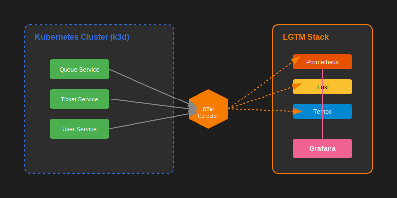
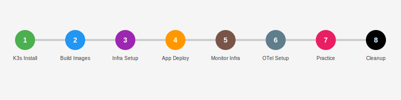

# 📊 Kubernetes 모니터링 핸즈온

[01. K3s 설치 (Mac OS + k3d) →](./01-k3s-install.md)

---

## 🏗️ 아키텍처 (Architecture)

본 핸즈온에서 구축하게 될 전체 시스템의 구조도입니다. 애플리케이션(Queue, Ticket, User)이 생성한 데이터가 OpenTelemetry Collector를 거쳐 LGTM 스택(Loki, Grafana, Tempo, Prometheus)으로 흘러가는 과정을 보여줍니다.

---

## 🗺️ 핸즈온 로드맵 (Steps)

총 8단계로 구성된 실습 과정을 시각적으로 정리하였습니다.

---

## 개요

이 핸즈온 시리즈는 Kubernetes 환경에서 마이크로서비스 애플리케이션의 관찰성(Observability)을 확보하는 방법을 다룹니다. OpenTelemetry와 LGTM 스택(Loki, Grafana, Tempo, Prometheus)을 활용하여 통합 모니터링 시스템을 구축해봅니다.

## 대상

- Kubernetes 기본 개념을 이해하고 있는 분
- MSA 환경에서의 모니터링/로깅/트레이싱 구축에 관심이 있는 분
- OpenTelemetry를 실무에 적용해보고 싶은 분

## 환경

- **Kubernetes Cluster**: 1.25+ (Minikube, Docker Desktop, EKS 등)
- **Helm**: 3.0+
- **kubectl**: 최신 버전

## 목차

| 스텝 | 제목 | 예상 시간 |
|------|------|----------|
| [01](./01-k3s-install.md) | K3s 설치 (Mac OS + k3d) | 10분 |
| [02](./02-build-images.md) | 애플리케이션 빌드 및 이미지 준비 | 10분 |
| [03](./03-infra-setup.md) | 인프라 구축 (RabbitMQ, Redis, DB) | 15분 |
| [04](./04-app-deploy.md) | 애플리케이션 통합 배포 | 20분 |
| [05](./05-monitoring-setup.md) | 모니터링 인프라 구축 (LGTM + OTel Operator) | 10분 |
| [06](./06-otel-instrumentation.md) | OpenTelemetry 연동 설정 | 15분 |
| [07](./07-monitoring-practice.md) | 모니터링 실습 및 검증 | 20분 |
| [08](./08-cleanup.md) | 리소스 정리 (Cleanup) | 5분 |

---

## 총 예상 소요 시간

약 **105분**

---

[01. K3s 설치 (Mac OS + k3d) →](./01-k3s-install.md)
