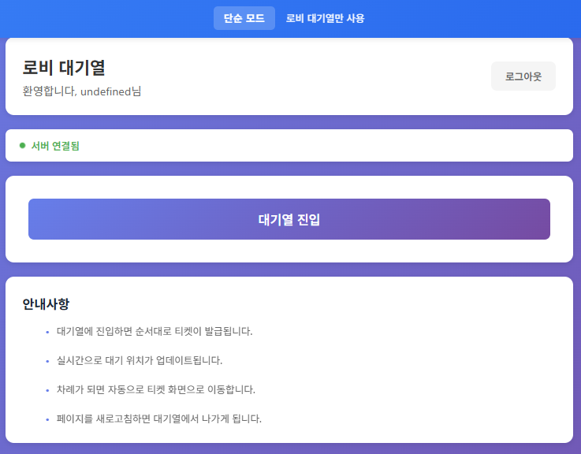
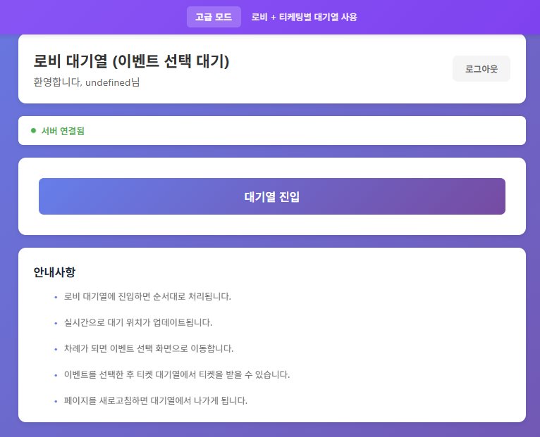

# 10. 프론트엔드 기동

[← 09. 백엔드 확인](./09-backend-verify.md) | [목차](./README.md) | [11. Redis 모니터링 →](./11-monitor-redis.md)

---

⏱️ **예상 소요 시간**: 3분

## 목표

프론트엔드를 빌드하고 기동하여 브라우저에서 접속합니다.

---

## 1. 프론트엔드 빌드 및 시작

```bash
# 프론트엔드 빌드 및 시작
docker compose up -d frontend
```

**예상 출력:**
```
[+] Building ...
[+] Running 1/1
 ✔ Container ticketing-frontend  Started
```

---

## 2. 빌드 진행 확인

첫 빌드 시 시간이 소요됩니다:

```bash
# 빌드 로그 실시간 확인
docker compose logs -f frontend
```

**빌드 완료 시 출력:**
```
ticketing-frontend  | ... nginx: the configuration file /etc/nginx/nginx.conf syntax is ok
ticketing-frontend  | ... nginx: configuration file /etc/nginx/nginx.conf test is successful
```

> 💡 `Ctrl+C`로 로그 확인 종료

---

## 3. 컨테이너 상태 확인

```bash
docker compose ps frontend
```

**예상 출력:**
```
NAME                 STATUS                   PORTS
ticketing-frontend   Up (healthy)             0.0.0.0:80->80/tcp
```

---

## 4. 브라우저 접속

브라우저에서 접속:

```
http://localhost
```

또는 (포트 80이 다른 서비스에서 사용 중인 경우):

```
http://localhost:80
```

**정상 접속 시:**
- 티켓팅 시스템 메인 페이지가 표시됩니다
- 사용자 등록 또는 이벤트 선택 화면이 나타납니다

### Simple 모드 화면

Simple 모드에서는 사용자 등록 후 바로 로비 대기열에 진입합니다.

<!-- TODO: Simple 모드 프론트엔드 메인 화면 캡쳐 (사용자 등록 폼이 보이는 상태) -->


### Advanced 모드 화면

Advanced 모드에서는 로비 대기열 통과 후 이벤트를 선택할 수 있습니다.

<!-- TODO: Advanced 모드 프론트엔드 화면 캡쳐 (이벤트 선택 화면 또는 "고급 모드" 배너가 보이는 상태) -->


> 💡 모드 변경 방법은 [11. Redis 모니터링](./11-monitor-redis.md#7-대기열-모드-변경하기)을 참고하세요.

---

## 5. 전체 서비스 상태 확인

모든 서비스가 정상 동작하는지 최종 확인:

```bash
docker compose ps
```

**예상 출력:**
```
NAME                          STATUS                   PORTS
ticketing-frontend            Up (healthy)             0.0.0.0:80->80/tcp
ticketing-postgres            Up (healthy)             0.0.0.0:5432->5432/tcp
ticketing-queue-service       Up (healthy)             0.0.0.0:3001->3001/tcp
ticketing-rabbitmq            Up (healthy)             0.0.0.0:15672->15672/tcp, ...
ticketing-redis               Up (healthy)             0.0.0.0:6379->6379/tcp
ticketing-redis-commander     Up                       0.0.0.0:8081->8081/tcp
ticketing-ticket-service      Up (healthy)             0.0.0.0:3002->3002/tcp
ticketing-user-service        Up (healthy)             0.0.0.0:3003->3003/tcp
```

**총 8개 컨테이너**가 실행 중이어야 합니다.

---

## 6. 접속 URL 정리

| 서비스 | URL | 용도 |
|--------|-----|------|
| Frontend | http://localhost | 메인 애플리케이션 |
| Queue Service API | http://localhost:3001 | 대기열 API |
| Ticket Service API | http://localhost:3002 | 티켓 API |
| User Service API | http://localhost:3003 | 사용자 API |
| Redis Commander | http://localhost:8081 | Redis 모니터링 |
| RabbitMQ Management | http://localhost:15672 | RabbitMQ 모니터링 |

---

## ✅ 체크포인트

다음을 확인하세요:

- [ ] 프론트엔드 컨테이너가 `Up (healthy)` 상태이다
- [ ] http://localhost 접속 시 페이지가 표시된다
- [ ] 총 8개 컨테이너가 모두 실행 중이다

---

🎉 **축하합니다!** 티켓팅 큐 시스템이 완전히 기동되었습니다.

다음 단계에서는 모니터링 도구 사용법을 알아봅니다.

---

[← 09. 백엔드 확인](./09-backend-verify.md) | [목차](./README.md) | [11. Redis 모니터링 →](./11-monitor-redis.md)
