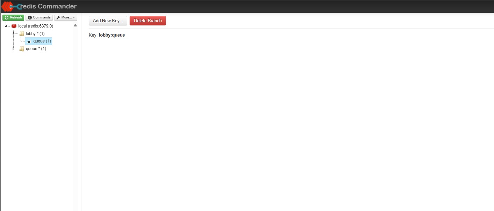
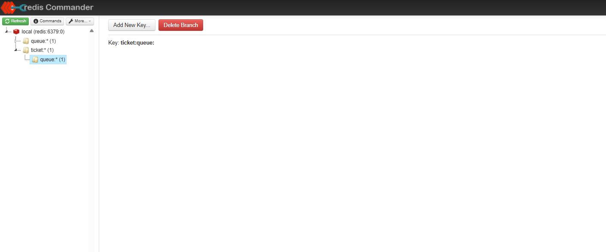
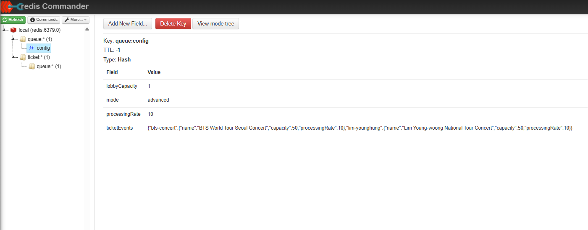
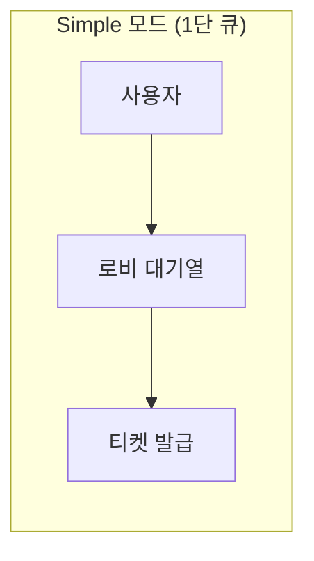
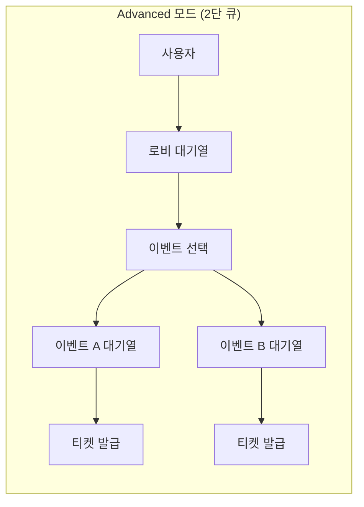

# 11. Redis 모니터링

[← 10. 프론트엔드 기동](./10-frontend-start.md) | [목차](./README.md) | [12. RabbitMQ 모니터링 →](./12-monitor-rabbitmq.md)

---

⏱️ **예상 소요 시간**: 3분

## 목표

Redis Commander를 사용하여 Redis 데이터를 모니터링합니다.

---

## 1. Redis Commander 접속

브라우저에서 접속:

```
http://localhost:8081
```

**화면 구성:**
- 좌측: 데이터베이스 및 키 목록
- 우측: 선택한 키의 상세 정보

### Redis Commander 메인 화면

<!-- TODO: Redis Commander 메인 화면 캡쳐 (키 목록이 보이는 상태) -->


### ZSET 데이터 상세 보기

`lobby:queue` 키를 클릭하면 대기열에 있는 사용자 목록을 확인할 수 있습니다.

<!-- TODO: lobby:queue ZSET 상세 화면 캡쳐 (멤버와 score가 보이는 상태) -->


### queue:config 설정 확인

`queue:config` 키를 클릭하면 현재 대기열 설정(mode, capacity 등)을 확인할 수 있습니다.

<!-- TODO: queue:config Hash 상세 화면 캡쳐 -->


---

## 2. 테스트 데이터 생성

> ⚠️ **처음 접속 시 키가 없나요?**  
> 서비스를 막 시작한 상태에서는 아직 대기열에 아무도 진입하지 않아 Redis에 키가 없습니다.  
> 아래 명령으로 테스트 데이터를 먼저 추가해보세요.

### 대기열에 테스트 사용자 추가

```bash
# 테스트 사용자 3명 추가
docker exec -it ticketing-redis redis-cli zadd lobby:queue $(date +%s)001 "test-user-1"
docker exec -it ticketing-redis redis-cli zadd lobby:queue $(date +%s)002 "test-user-2"
docker exec -it ticketing-redis redis-cli zadd lobby:queue $(date +%s)003 "test-user-3"
```

**예상 출력:**
```
(integer) 1
(integer) 1
(integer) 1
```

### 데이터 확인

```bash
# 대기열 확인
docker exec -it ticketing-redis redis-cli zrange lobby:queue 0 -1 withscores
```

**예상 출력:**
```
1) "test-user-1"
2) "1738600000001"
3) "test-user-2"
4) "1738600000002"
5) "test-user-3"
6) "1738600000003"
```

> 💡 **Redis Commander 새로고침**: 브라우저에서 `F5` 또는 새로고침 버튼을 누르면 추가된 키가 표시됩니다.

---

## 3. 대기열 데이터 확인 (웹 UI)

### 키 목록 확인

좌측 패널에서 `db0`을 클릭하면 저장된 키 목록이 표시됩니다.

**대기열 관련 키 패턴:**
- `lobby:queue` - 로비 대기열 (ZSET)
- `queue:*` - 이벤트별 대기열
- `config:*` - 설정 정보

### ZSET 데이터 확인

대기열은 Redis ZSET(Sorted Set)으로 저장됩니다:

1. `lobby:queue` 키 클릭
2. Type: `zset` 확인
3. Members: 대기 중인 사용자 목록

---

## 4. CLI로 Redis 데이터 확인

### 모든 키 조회

```bash
docker exec -it ticketing-redis redis-cli keys '*'
```

### 대기열 크기 확인

```bash
# lobby:queue의 멤버 수 (대기 인원)
docker exec -it ticketing-redis redis-cli zcard lobby:queue
```

### 대기열 멤버 조회

```bash
# 대기열의 모든 멤버 조회 (score 포함)
docker exec -it ticketing-redis redis-cli zrange lobby:queue 0 -1 withscores
```

### 특정 사용자 순위 확인

```bash
# 사용자의 대기 순위 (0부터 시작)
docker exec -it ticketing-redis redis-cli zrank lobby:queue "<user-id>"
```

---

## 5. 실시간 모니터링

### Redis MONITOR 명령

실시간으로 Redis 명령어를 모니터링합니다:

```bash
docker exec -it ticketing-redis redis-cli monitor
```

**출력 예시:**
```
1234567890.123456 [0 172.18.0.5:54321] "ZADD" "lobby:queue" "1234567890" "user-123"
1234567890.234567 [0 172.18.0.5:54321] "ZRANK" "lobby:queue" "user-123"
```

> 💡 `Ctrl+C`로 종료

### Redis INFO 명령

Redis 서버 상태 확인:

```bash
# 메모리 사용량
docker exec -it ticketing-redis redis-cli info memory | grep used_memory_human

# 연결된 클라이언트 수
docker exec -it ticketing-redis redis-cli info clients | grep connected_clients

# 키 통계
docker exec -it ticketing-redis redis-cli info keyspace
```

---

## 6. 테스트 데이터 삭제

테스트가 끝나면 데이터를 정리합니다:

```bash
# 테스트 데이터 삭제
docker exec -it ticketing-redis redis-cli zrem lobby:queue "test-user-1" "test-user-2" "test-user-3"
```

---

## 7. 대기열 모드 변경하기

> ⚠️ **중요**: 대기열 설정은 Redis에 저장됩니다. `.env` 파일의 `QUEUE_MODE`를 변경해도 이미 Redis에 저장된 설정이 우선 적용됩니다.

### Simple vs Advanced 모드

| 모드 | 구조 | 설명 |
|------|------|------|
| **Simple** | 1단 큐 | 로비 대기열만 사용. 대기 후 바로 티켓 발급 |
| **Advanced** | 2단 큐 | 로비 대기열 → 이벤트 선택 → 이벤트별 대기열 → 티켓 발급 |





### 현재 설정 확인

```bash
docker exec -it ticketing-redis redis-cli hgetall queue:config
```

**예상 출력:**
```
1) "mode"
2) "simple"
3) "lobbyCapacity"
4) "1"
5) "processingRate"
6) "10"
```

### 모드 변경 (simple → advanced)

```bash
# 방법 1: mode만 변경
docker exec -it ticketing-redis redis-cli hset queue:config mode advanced

# 방법 2: 설정 전체 삭제 후 서비스 재시작 (환경변수로 다시 초기화)
docker exec -it ticketing-redis redis-cli del queue:config
docker-compose restart queue-service
```

### 변경 확인

```bash
# Redis 설정 확인
docker exec -it ticketing-redis redis-cli hget queue:config mode

# API로 확인
curl -s http://localhost:3001/api/queue/mode | jq
```

**예상 출력:**
```json
{
  "success": true,
  "data": {
    "mode": "advanced"
  }
}
```

> 💡 프론트엔드 새로고침하면 "고급 모드" 배너가 표시됩니다.

---

## 8. Advanced 모드: 이벤트 동기화

> ⚠️ **중요**: Advanced 모드에서는 DB의 이벤트가 Redis에 동기화되어야 이벤트 목록이 표시됩니다.  
> 이벤트 동기화는 **queue-service 시작 시점**에 mode가 `advanced`일 때만 실행됩니다.

### 이벤트가 안 보일 때

mode를 `advanced`로 변경한 후에도 이벤트가 안 보인다면, queue-service를 재시작해야 합니다:

```bash
# queue-service 재시작
docker-compose restart queue-service

# 로그에서 이벤트 동기화 확인
docker-compose logs queue-service | grep -i "event sync"
```

**예상 로그:**
```
Starting event synchronization from DB to Redis...
Event synced to Redis { eventId: '...', name: '콘서트 A', capacity: 100 }
Event synchronization completed { syncedCount: 3 }
```

### 한 번에 설정 초기화 + 이벤트 동기화

```bash
# Redis 설정 삭제 → 재시작 시 환경변수로 초기화 + 이벤트 동기화
docker exec -it ticketing-redis redis-cli del queue:config
docker-compose restart queue-service
```

### 동기화된 이벤트 확인

```bash
# Redis에 저장된 이벤트 설정 확인
docker exec -it ticketing-redis redis-cli hget queue:config ticketEvents
```

---

## 9. 주요 Redis 명령어 정리

| 명령어 | 설명 |
|--------|------|
| `KEYS *` | 모든 키 조회 |
| `ZCARD <key>` | ZSET 멤버 수 |
| `ZRANGE <key> 0 -1` | ZSET 모든 멤버 조회 |
| `ZRANK <key> <member>` | 멤버의 순위 |
| `ZADD <key> <score> <member>` | 멤버 추가 |
| `ZREM <key> <member>` | 멤버 삭제 |
| `INFO` | 서버 정보 |
| `MONITOR` | 실시간 명령 모니터링 |

---

## ✅ 체크포인트

다음을 확인하세요:

- [ ] Redis Commander (http://localhost:8081) 접속 가능
- [ ] `keys '*'` 명령으로 키 목록 조회 가능
- [ ] ZSET 데이터 구조 이해 (score 기반 정렬)

---

[← 10. 프론트엔드 기동](./10-frontend-start.md) | [목차](./README.md) | [12. RabbitMQ 모니터링 →](./12-monitor-rabbitmq.md)
