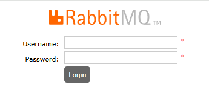
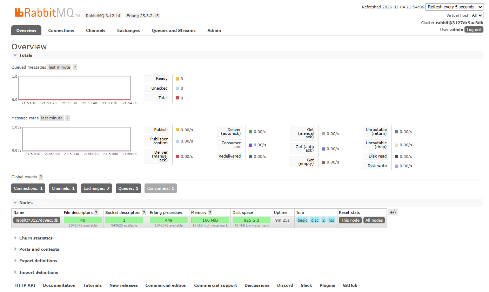
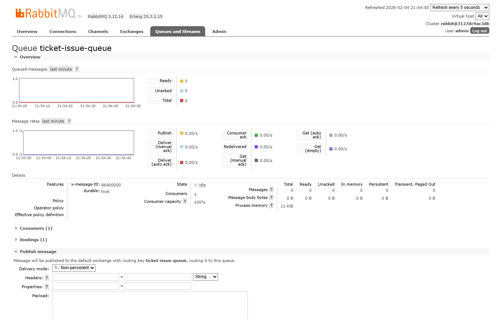
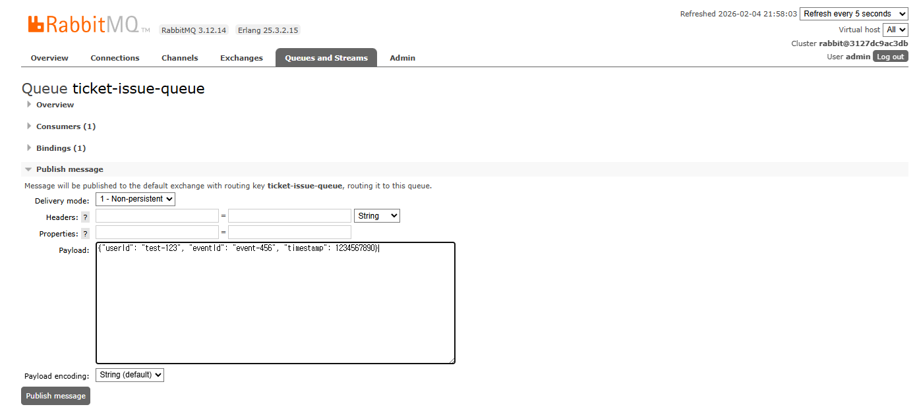
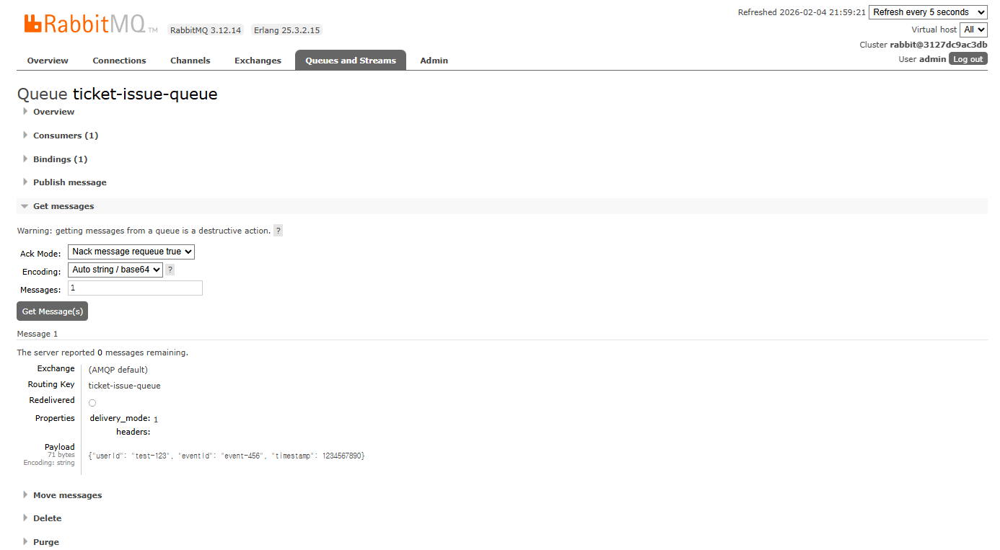
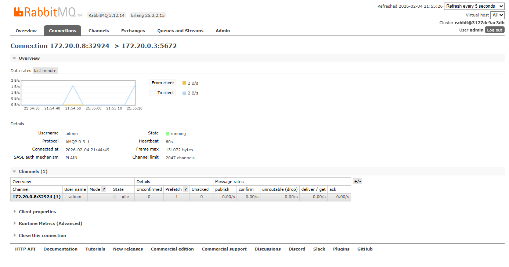

# 13. RabbitMQ 모니터링

[← 12. Redis 모니터링](./12-monitor-redis.md) | [목차](./README.md) | [14. Kafka 모니터링 →](./14-monitor-kafka.md)

---

⏱️ **예상 소요 시간**: 3분

## 목표

RabbitMQ Management UI를 사용하여 메시지 큐를 모니터링합니다.

---

## 1. RabbitMQ Management 접속

브라우저에서 접속:

```
http://localhost:15672
```

**로그인 정보:**
- Username: `admin`
- Password: `password`

### 로그인 화면

<!-- TODO: RabbitMQ 로그인 화면 캡쳐 -->


---

## 2. 대시보드 개요

로그인 후 Overview 탭에서 확인할 수 있는 정보:

| 항목 | 설명 |
|------|------|
| Queued messages | 대기 중인 메시지 수 |
| Message rates | 초당 메시지 처리량 |
| Connections | 연결된 클라이언트 수 |
| Channels | 열린 채널 수 |

### Overview 대시보드

<!-- TODO: RabbitMQ Overview 대시보드 캡쳐 (메시지 그래프, 노드 정보가 보이는 상태) -->


---

## 3. Queues 탭

**Queues** 탭을 클릭하면 생성된 큐 목록이 표시됩니다.

### Queues 탭 화면

<!-- TODO: RabbitMQ Queues 탭 캡쳐 (큐 목록, 메시지 수, 컨슈머 수가 보이는 상태) -->


### 주요 큐

| 큐 이름 | 용도 |
|---------|------|
| `ticket-issue-queue` | 티켓 발급 요청 |
| `queue-events` | 대기열 이벤트 |

### 큐 상세 정보

큐 이름을 클릭하면:
- **Messages**: Ready / Unacked / Total
- **Message rates**: Publish / Deliver
- **Consumers**: 연결된 컨슈머 수

---

## 4. CLI로 RabbitMQ 확인

### 큐 목록 조회

```bash
docker exec -it ticketing-rabbitmq rabbitmqctl list_queues name messages consumers
```

**예상 출력:**
```
Listing queues for vhost / ...
name                    messages    consumers
ticket-issue-queue      0           1
queue-events            0           1
```

### 연결 목록 조회

```bash
docker exec -it ticketing-rabbitmq rabbitmqctl list_connections user client_properties
```

### Exchange 목록 조회

```bash
docker exec -it ticketing-rabbitmq rabbitmqctl list_exchanges name type
```

---

## 5. 메시지 발행 테스트

Management UI에서 직접 메시지를 발행해봅니다:

1. **Queues** 탭 → `ticket-issue-queue` 클릭
2. **Publish message** 섹션 펼치기
3. **Payload**에 테스트 메시지 입력:
   ```json
   {"userId": "test-123", "eventId": "event-456", "timestamp": 1234567890}
   ```
4. **Publish message** 버튼 클릭

### Publish message 화면

<!-- TODO: RabbitMQ Publish message 섹션 캡쳐 (Payload 입력란과 Publish message 버튼이 보이는 상태) -->


### 메시지 확인

1. **Get messages** 섹션 펼치기
2. **Ack Mode**: `Nack message requeue true` 선택
3. **Get Message(s)** 버튼 클릭

발행한 메시지 내용이 표시됩니다.

### Get messages 화면

<!-- TODO: RabbitMQ Get messages 섹션 캡쳐 (메시지 내용이 표시된 상태) -->


---

## 6. Connections 탭

연결된 클라이언트 정보 확인:

| 항목 | 설명 |
|------|------|
| Name | 연결 식별자 |
| User | 인증된 사용자 |
| State | 연결 상태 (running) |
| Channels | 열린 채널 수 |

### Connections 탭 화면

<!-- TODO: RabbitMQ Connections 탭 캡쳐 (연결된 클라이언트 목록이 보이는 상태) -->


**queue-service**가 연결되어 있어야 합니다.

---

## 7. 주요 메트릭 모니터링

### 메시지 처리량

Overview 탭의 **Message rates** 그래프:
- **Publish**: 발행된 메시지/초
- **Deliver**: 전달된 메시지/초
- **Ack**: 확인된 메시지/초

### 큐 깊이

Queues 탭에서 각 큐의 **Messages** 열:
- **Ready**: 처리 대기 중
- **Unacked**: 처리 중 (아직 ACK 안됨)

> ⚠️ Ready 메시지가 계속 쌓이면 컨슈머 처리 속도가 느린 것입니다.

---

## 8. 알림 설정 (선택)

Admin 탭 → Policies에서 큐 정책 설정 가능:
- 메시지 TTL
- 최대 큐 길이
- Dead Letter Exchange

---

## ✅ 체크포인트

다음을 확인하세요:

- [ ] RabbitMQ Management (http://localhost:15672) 로그인 성공
- [ ] Queues 탭에서 큐 목록 확인 가능
- [ ] Connections 탭에서 queue-service 연결 확인
- [ ] 테스트 메시지 발행 및 조회 성공

---

[← 12. Redis 모니터링](./12-monitor-redis.md) | [목차](./README.md) | [14. Kafka 모니터링 →](./14-monitor-kafka.md)
