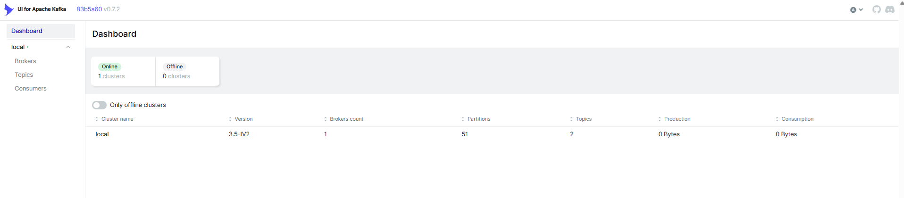
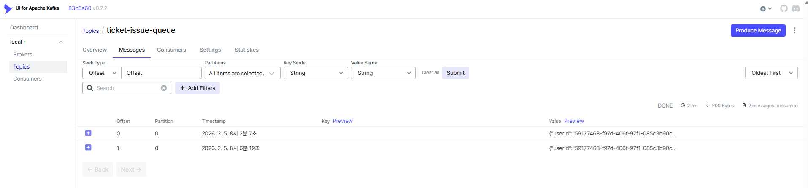
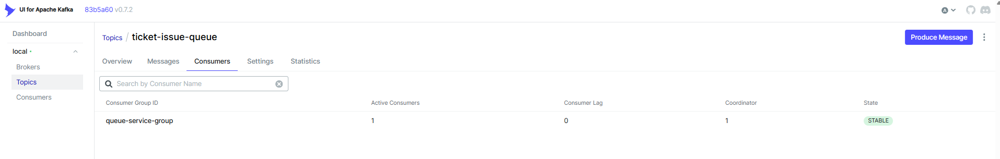
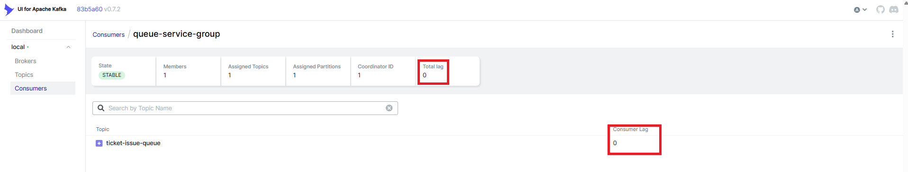

# 14. Kafka 모니터링

[← 13. RabbitMQ 모니터링](./13-monitor-rabbitmq.md) | [목차](./README.md) | [15. SQS 모니터링 →](./15-monitor-sqs.md)

---

⏱️ **예상 소요 시간**: 3분

## 목표

Kafka UI를 사용하여 메시지 큐를 모니터링합니다.

---

## 1. Kafka 프로필로 실행

Kafka를 사용하려면 `--profile kafka` 옵션으로 실행해야 합니다:

```bash
docker-compose --profile kafka up -d
```

### 환경 변수 설정

`.env` 파일에서 Kafka 사용 설정:

```env
QUEUE_PROVIDER=kafka
KAFKA_BROKERS=kafka:29092
KAFKA_CLIENT_ID=queue-service
KAFKA_GROUP_ID=queue-service-group
```

---

## 2. Kafka UI 접속

브라우저에서 접속:

```
http://localhost:8082
```

> 💡 Kafka UI는 별도 로그인 없이 바로 접속됩니다.

### Kafka UI 메인 화면

<!-- TODO: Kafka UI 메인 화면 캡쳐 -->


---

## 3. Topics 확인

**Topics** 메뉴를 클릭하면 생성된 토픽 목록이 표시됩니다.

### Topics 목록 화면

<!-- TODO: Kafka UI Topics 목록 캡쳐 -->


### 주요 토픽

| 토픽 이름 | 용도 |
|-----------|------|
| `ticket-issue-queue` | 티켓 발급 요청 |

### 토픽 상세 정보

토픽 이름을 클릭하면:
- **Overview**: 파티션 수, 복제 팩터, 메시지 수
- **Messages**: 토픽에 저장된 메시지 내용
- **Consumers**: 연결된 컨슈머 그룹

---

## 4. Messages 탭

토픽의 **Messages** 탭에서 실제 메시지 내용을 확인할 수 있습니다.

### Messages 탭 화면

<!-- TODO: Kafka UI Messages 탭 캡쳐 (메시지 내용이 보이는 상태) -->


### 메시지 필터링

- **Offset**: 특정 오프셋부터 조회
- **Timestamp**: 특정 시간 이후 메시지 조회
- **Search**: 메시지 내용 검색

---

## 5. Consumers 확인

**Consumers** 메뉴에서 컨슈머 그룹 상태를 확인합니다.

### Consumers 화면

<!-- TODO: Kafka UI Consumers 화면 캡쳐 -->


### 주요 메트릭

| 항목 | 설명 |
|------|------|
| Consumer Group | 컨슈머 그룹 ID |
| Members | 그룹 내 컨슈머 수 |
| Topics | 구독 중인 토픽 |
| Lag | 처리되지 않은 메시지 수 |

> ⚠️ **Lag**가 계속 증가하면 컨슈머 처리 속도가 느린 것입니다.

---

## 6. Consumer Lag 이해하기

Kafka에서 가장 중요한 모니터링 지표는 **Consumer Lag**입니다.

```
Lag = End Offset - Current Offset
```

| Lag 값 | 의미 |
|--------|------|
| 0 | 모든 메시지가 처리됨 |
| > 0 | 아직 처리되지 않은 메시지 있음 |
| 계속 증가 | 컨슈머가 프로듀서를 따라가지 못함 |

### Consumer Lag 화면

<!-- TODO: Kafka UI Consumer Lag 화면 캡쳐 -->


---

## 7. CLI로 Kafka 확인

### 토픽 목록 조회

```bash
docker exec -it ticketing-kafka kafka-topics --bootstrap-server localhost:9092 --list
```

**예상 출력:**
```
ticket-issue-queue
```

### 토픽 상세 정보

```bash
docker exec -it ticketing-kafka kafka-topics --bootstrap-server localhost:9092 --describe --topic ticket-issue-queue
```

### 컨슈머 그룹 목록

```bash
docker exec -it ticketing-kafka kafka-consumer-groups --bootstrap-server localhost:9092 --list
```

### 컨슈머 그룹 상세 (Lag 확인)

```bash
docker exec -it ticketing-kafka kafka-consumer-groups --bootstrap-server localhost:9092 --describe --group queue-service-group
```

**예상 출력:**
```
GROUP                TOPIC                PARTITION  CURRENT-OFFSET  LOG-END-OFFSET  LAG
queue-service-group  ticket-issue-queue   0          5               5               0
```

---

## 8. 메시지 발행 테스트

CLI로 테스트 메시지를 발행해봅니다:

```bash
docker exec -it ticketing-kafka kafka-console-producer --bootstrap-server localhost:9092 --topic ticket-issue-queue
```

프롬프트가 나타나면 JSON 메시지 입력:
```json
{"userId": "test-123", "eventId": "event-456", "timestamp": 1234567890}
```

`Ctrl+C`로 종료합니다.

### 메시지 소비 확인

```bash
docker exec -it ticketing-kafka kafka-console-consumer --bootstrap-server localhost:9092 --topic ticket-issue-queue --from-beginning
```

발행한 메시지가 표시됩니다. `Ctrl+C`로 종료합니다.

---

## ✅ 체크포인트

다음을 확인하세요:

- [ ] Kafka UI (http://localhost:8082) 접속 성공
- [ ] Topics에서 `ticket-issue-queue` 토픽 확인
- [ ] Consumers에서 `queue-service-group` 확인
- [ ] Consumer Lag가 0인지 확인

---

[← 13. RabbitMQ 모니터링](./13-monitor-rabbitmq.md) | [목차](./README.md) | [15. SQS 모니터링 →](./15-monitor-sqs.md)
