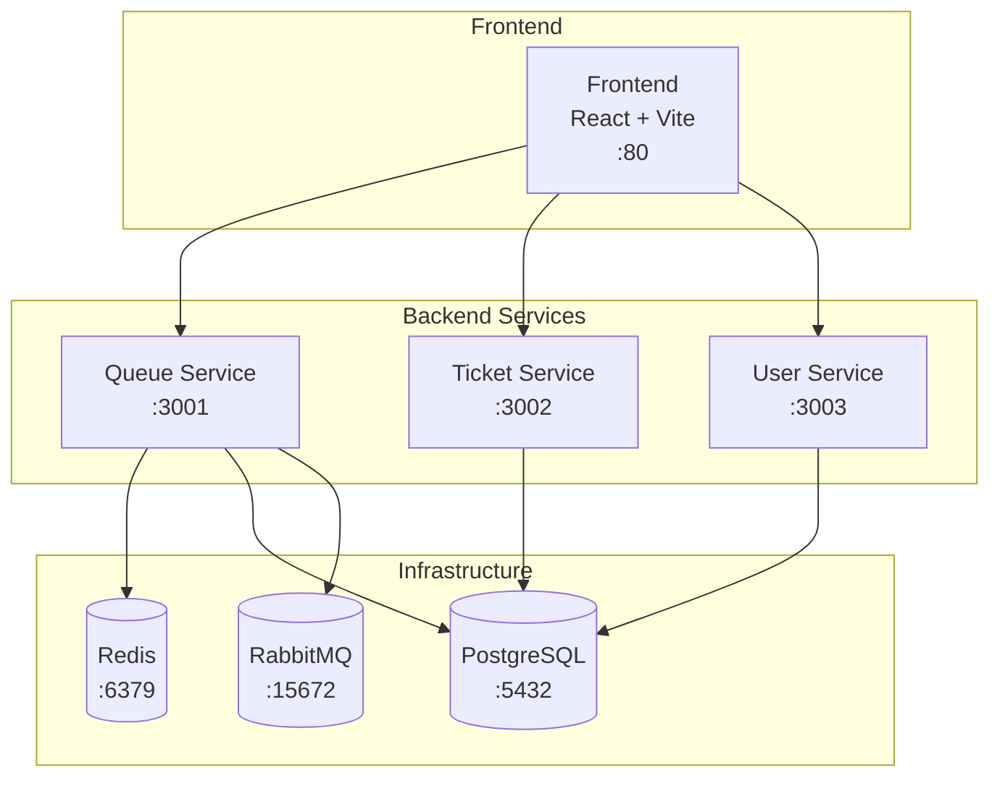

# 🎫 티켓팅 큐 시스템 핸즈온 튜토리얼

[01. Docker 설치 →](./01-docker-install.md)

---

## 개요

이 핸즈온 튜토리얼은 티켓팅 큐 시스템을 Docker 환경에서 처음부터 끝까지 실행해보는 가이드입니다.

## 대상

- Docker를 처음 사용하는 개발자
- 마이크로서비스 아키텍처를 학습하고 싶은 분
- Redis, RabbitMQ 등 인프라 구성을 경험해보고 싶은 분

## 환경

- **OS**: macOS (Intel/Apple Silicon)
- **필수**: Docker Desktop, Git
- **권장 메모리**: 8GB 이상

## 전체 구성

## 목차

### 환경 준비
| 스텝 | 제목 | 예상 시간 |
|------|------|----------|
| [01](./01-docker-install.md) | Docker Desktop 설치 | 5분 |
| [02](./02-docker-verify.md) | Docker 설치 확인 | 3분 |
| [03](./03-project-clone.md) | 프로젝트 클론 | 2분 |
| [04](./04-env-setup.md) | 환경변수 설정 | 3분 |

### 인프라 구성
| 스텝 | 제목 | 예상 시간 |
|------|------|----------|
| [05](./05-infra-start.md) | 인프라 서비스 기동 | 3분 |
| [06](./06-infra-verify.md) | 인프라 상태 확인 | 3분 |

### 서비스 기동
| 스텝 | 제목 | 예상 시간 |
|------|------|----------|
| [07](./07-backend-build.md) | 백엔드 이미지 빌드 | 5분 |
| [08](./08-backend-start.md) | 백엔드 서비스 기동 | 2분 |
| [09](./09-backend-verify.md) | 백엔드 동작 확인 | 3분 |
| [10](./10-frontend-start.md) | 프론트엔드 기동 | 3분 |

### 모니터링
| 스텝 | 제목 | 예상 시간 |
|------|------|----------|
| [11](./11-monitor-redis.md) | Redis 모니터링 | 3분 |
| [12](./12-monitor-rabbitmq.md) | RabbitMQ 모니터링 | 3분 |
| [13](./13-monitor-logs.md) | 로그 확인 | 3분 |

### 문제 해결
| 스텝 | 제목 |
|------|------|
| [14](./14-trouble-docker.md) | Docker 관련 문제 |
| [15](./15-trouble-network.md) | 네트워크/포트 문제 |
| [16](./16-trouble-service.md) | 서비스 기동 문제 |

### 정리
| 스텝 | 제목 | 예상 시간 |
|------|------|----------|
| [17](./17-cleanup.md) | 리소스 정리 | 2분 |

---

## 총 예상 소요 시간

약 **40분** (문제 해결 제외)

---

[01. Docker 설치 →](./01-docker-install.md)
